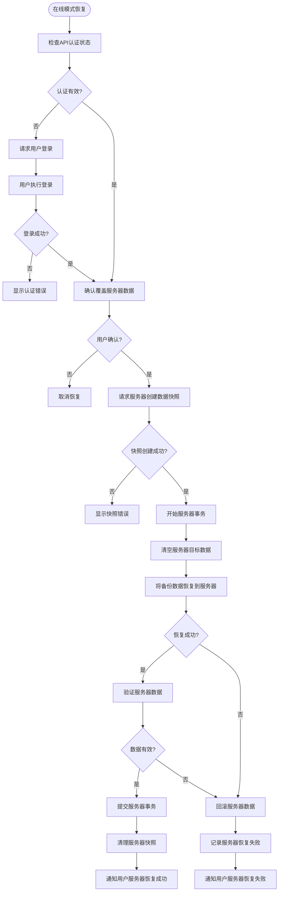

```mermaid
flowchart TD
    Start([在线模式恢复]) --> CheckAuth[检查API认证状态]
    CheckAuth --> AuthValid{认证有效?}
    
    AuthValid -->|否| RequestLogin[请求用户登录]
    AuthValid -->|是| ConfirmServerOverwrite[确认覆盖服务器数据]
    
    RequestLogin --> UserLogin[用户执行登录]
    UserLogin --> LoginSuccess{登录成功?}
    LoginSuccess -->|否| ShowAuthError[显示认证错误]
    LoginSuccess -->|是| ConfirmServerOverwrite
    
    ConfirmServerOverwrite --> UserConfirm{用户确认?}
    UserConfirm -->|否| CancelRestore[取消恢复]
    UserConfirm -->|是| RequestServerSnapshot[请求服务器创建数据快照]
    
    RequestServerSnapshot --> SnapshotCreated{快照创建成功?}
    SnapshotCreated -->|否| ShowSnapshotError[显示快照错误]
    SnapshotCreated -->|是| BeginServerTransaction[开始服务器事务]
    
    BeginServerTransaction --> ClearServerData[清空服务器目标数据]
    ClearServerData --> RestoreToServer[将备份数据恢复到服务器]
    
    RestoreToServer --> ServerRestoreSuccess{恢复成功?}
    ServerRestoreSuccess -->|是| VerifyServerData[验证服务器数据]
    ServerRestoreSuccess -->|否| RollbackServer[回滚服务器数据]
    
    VerifyServerData --> ServerDataValid{数据有效?}
    ServerDataValid -->|是| CommitServerChanges[提交服务器事务]
    ServerDataValid -->|否| RollbackServer
    
    CommitServerChanges --> CleanupServerSnapshot[清理服务器快照]
    RollbackServer --> LogServerFailure[记录服务器恢复失败]
    
    CleanupServerSnapshot --> NotifyServerSuccess[通知用户服务器恢复成功]
    LogServerFailure --> NotifyServerFailure[通知用户服务器恢复失败]
```