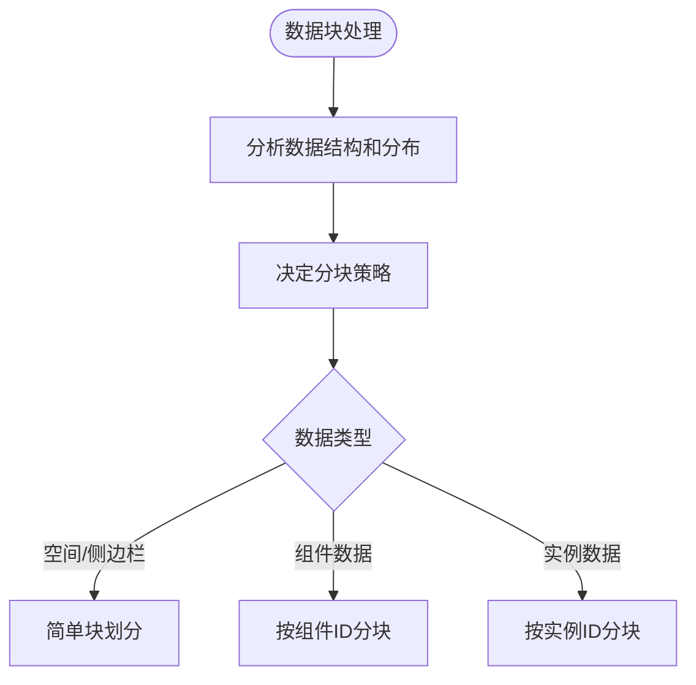

```mermaid
flowchart TD
    Start([数据块处理]) --> AnalyzeData[分析数据结构和分布]
    AnalyzeData --> DecideStrategy[决定分块策略]
    
    DecideStrategy --> DataType{数据类型}
    
    DataType -->|空间/侧边栏| SimpleChunk[简单块划分]
    DataType -->|组件数据| ComponentChunk[按组件ID分块]
    DataType -->|实例数据| InstanceChunk[按实例ID分块]
    
  
```