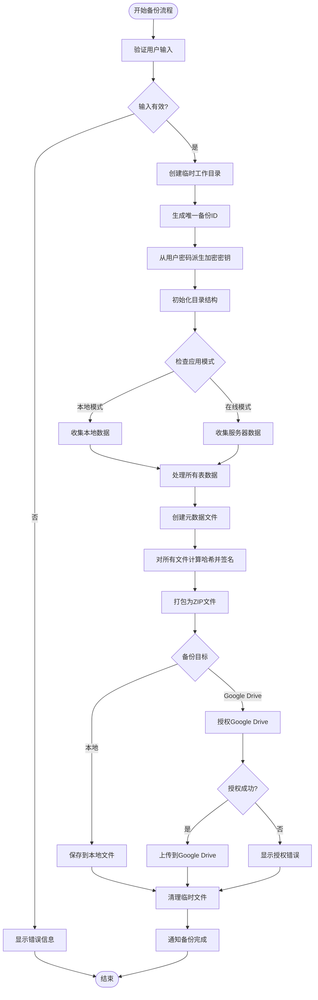

```mermaid
flowchart TD
    Start([开始备份流程]) --> ValidateInput[验证用户输入]
    ValidateInput --> InputValid{输入有效?}
    
    InputValid -->|否| ShowError[显示错误信息]
    InputValid -->|是| CreateTempDir[创建临时工作目录]
    
    ShowError --> End([结束])
    
    CreateTempDir --> GenerateBackupID[生成唯一备份ID]
    GenerateBackupID --> DeriveKey[从用户密码派生加密密钥]
    DeriveKey --> InitializeStructure[初始化目录结构]
    
    InitializeStructure --> CheckMode{检查应用模式}
    CheckMode -->|本地模式| CollectLocalData[收集本地数据]
    CheckMode -->|在线模式| CollectServerData[收集服务器数据]
    
    CollectLocalData --> ProcessAllTables[处理所有表数据]
    CollectServerData --> ProcessAllTables
    
    ProcessAllTables --> CreateMetadata[创建元数据文件]
    CreateMetadata --> SignFiles[对所有文件计算哈希并签名]
    SignFiles --> PackageBackup[打包为ZIP文件]
    
    PackageBackup --> BackupDestination{备份目标}
    BackupDestination -->|本地| SaveLocal[保存到本地文件]
    BackupDestination -->|Google Drive| AuthGDrive[授权Google Drive]
    
    AuthGDrive --> GDriveAuth{授权成功?}
    GDriveAuth -->|否| ShowAuthError[显示授权错误]
    GDriveAuth -->|是| UploadToGDrive[上传到Google Drive]
    
    SaveLocal --> CleanupTemp[清理临时文件]
    UploadToGDrive --> CleanupTemp
    ShowAuthError --> CleanupTemp
    
    CleanupTemp --> NotifyComplete[通知备份完成]
    NotifyComplete --> End
```