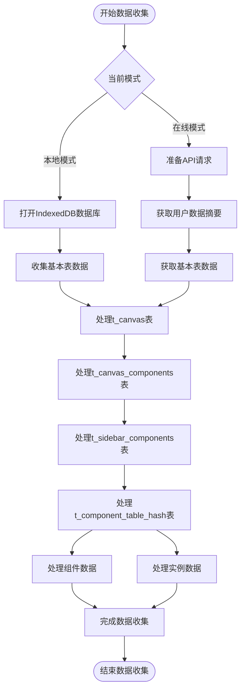

```mermaid
flowchart TD
    Start([开始数据收集]) --> CheckMode{当前模式}
    
    CheckMode -->|本地模式| OpenIndexedDB[打开IndexedDB数据库]
    CheckMode -->|在线模式| PrepareAPIRequests[准备API请求]
    
    OpenIndexedDB --> CollectBasicTables[收集基本表数据]
    PrepareAPIRequests --> FetchUserDataSummary[获取用户数据摘要]
    FetchUserDataSummary --> FetchBasicTables[获取基本表数据]
    
    CollectBasicTables --> ProcessCanvas[处理t_canvas表]
    FetchBasicTables --> ProcessCanvas
    
    ProcessCanvas --> ProcessCanvasComponents[处理t_canvas_components表]
    ProcessCanvasComponents --> ProcessSidebarComponents[处理t_sidebar_components表]
    ProcessSidebarComponents --> ProcessHashTables[处理t_component_table_hash表]
    
    ProcessHashTables --> ProcessComponentData[处理组件数据]
    ProcessHashTables --> ProcessInstanceData[处理实例数据]
    
    ProcessComponentData --> CompleteDataCollection[完成数据收集]
    ProcessInstanceData --> CompleteDataCollection
    
    CompleteDataCollection --> End([结束数据收集])
```