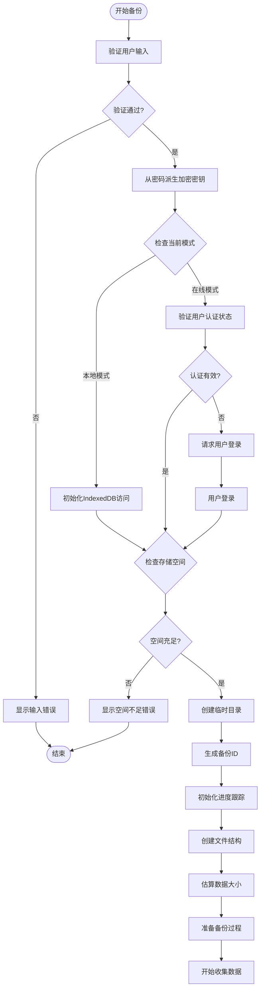

```mermaid
flowchart TD
    Start([开始备份]) --> ValidateInput[验证用户输入]
    ValidateInput --> InputValid{验证通过?}
    
    InputValid -->|否| ShowInputError[显示输入错误]
    InputValid -->|是| DeriveKey[从密码派生加密密钥]
    
    ShowInputError --> End([结束])
    
    DeriveKey --> CheckMode{检查当前模式}
    
    CheckMode -->|本地模式| InitIndexedDB[初始化IndexedDB访问]
    CheckMode -->|在线模式| ValidateAuth[验证用户认证状态]
    
    InitIndexedDB --> CheckStorage{检查存储空间}
    ValidateAuth --> AuthValid{认证有效?}
    
    AuthValid -->|否| RequestLogin[请求用户登录]
    AuthValid -->|是| CheckStorage
    
    RequestLogin --> UserLogin[用户登录]
    UserLogin --> CheckStorage
    
    CheckStorage --> EnoughSpace{空间充足?}
    EnoughSpace -->|否| ShowSpaceError[显示空间不足错误]
    EnoughSpace -->|是| CreateTempDir[创建临时目录]
    
    ShowSpaceError --> End
    
    CreateTempDir --> GenerateBackupID[生成备份ID]
    GenerateBackupID --> InitProgress[初始化进度跟踪]
    InitProgress --> CreateStructure[创建文件结构]
    
    CreateStructure --> EstimateSize[估算数据大小]
    EstimateSize --> PrepareBackup[准备备份过程]
    PrepareBackup --> StartDataCollection[开始收集数据]
```