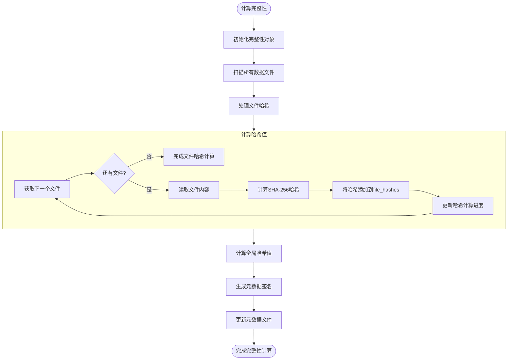

```mermaid
flowchart TD
    Start([计算完整性]) --> InitIntegrity[初始化完整性对象]
    InitIntegrity --> ScanFiles[扫描所有数据文件]
    ScanFiles --> ProcessFiles[处理文件哈希]
    
    subgraph HashCalculation [计算哈希值]
        PF1[获取下一个文件] --> PF2{还有文件?}
        PF2 -->|否| PF7[完成文件哈希计算]
        PF2 -->|是| PF3[读取文件内容]
        PF3 --> PF4[计算SHA-256哈希]
        PF4 --> PF5[将哈希添加到file_hashes]
        PF5 --> PF6[更新哈希计算进度]
        PF6 --> PF1
    end
    
    ProcessFiles --> HashCalculation
    
    HashCalculation --> CalculateGlobalHash[计算全局哈希值]
    CalculateGlobalHash --> GenerateSignature[生成元数据签名]
    
    GenerateSignature --> UpdateMetadata[更新元数据文件]
    UpdateMetadata --> End([完成完整性计算])
```