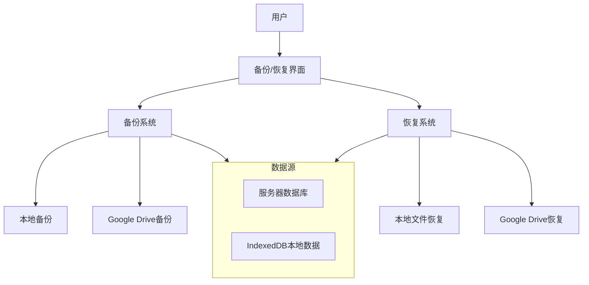

```mermaid
graph TD
    User[用户] --> Interface[备份/恢复界面]
    Interface --> BackupSystem[备份系统]
    Interface --> RestoreSystem[恢复系统]
    
    BackupSystem --> LocalStorage[本地备份]
    BackupSystem --> GoogleDrive[Google Drive备份]
    
    RestoreSystem --> LocalRestore[本地文件恢复]
    RestoreSystem --> DriveRestore[Google Drive恢复]
    
    subgraph DataSources [数据源]
        OnlineDB[服务器数据库]
        LocalDB[IndexedDB本地数据]
    end
    
    BackupSystem --> DataSources
    RestoreSystem --> DataSources
```