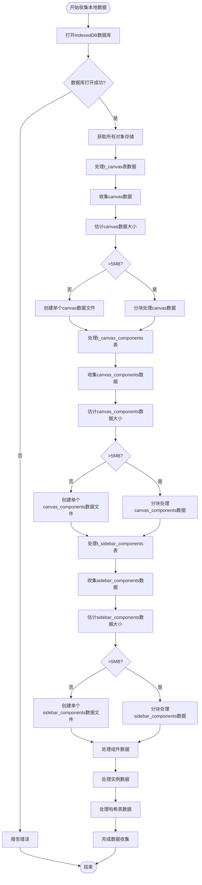

```mermaid
flowchart TD
    Start([开始收集本地数据]) --> OpenDB[打开IndexedDB数据库]
    OpenDB --> DBStatus{数据库打开成功?}
    
    DBStatus -->|否| ReportError[报告错误]
    DBStatus -->|是| GetStores[获取所有对象存储]
    
    ReportError --> End([结束])
    
    GetStores --> ProcessCanvasData[处理t_canvas表数据]
    ProcessCanvasData --> CCanvasData[收集canvas数据]
    CCanvasData --> EstimateCanvasSize[估计canvas数据大小]
    
    EstimateCanvasSize --> CanvasSize{>5MB?}
    CanvasSize -->|否| SingleCanvasFile[创建单个canvas数据文件]
    CanvasSize -->|是| ChunkCanvasData[分块处理canvas数据]
    
    SingleCanvasFile --> ProcessCanvasComponents[处理t_canvas_components表]
    ChunkCanvasData --> ProcessCanvasComponents
    
    ProcessCanvasComponents --> CCCData[收集canvas_components数据]
    CCCData --> EstimateCCCSize[估计canvas_components数据大小]
    
    EstimateCCCSize --> CCCSize{>5MB?}
    CCCSize -->|否| SingleCCCFile[创建单个canvas_components数据文件]
    CCCSize -->|是| ChunkCCCData[分块处理canvas_components数据]
    
    SingleCCCFile --> ProcessSidebarComponents[处理t_sidebar_components表]
    ChunkCCCData --> ProcessSidebarComponents
    
    ProcessSidebarComponents --> CSCData[收集sidebar_components数据]
    CSCData --> EstimateSCCSize[估计sidebar_components数据大小]
    
    EstimateSCCSize --> SCCSize{>5MB?}
    SCCSize -->|否| SingleSCCFile[创建单个sidebar_components数据文件]
    SCCSize -->|是| ChunkSCCData[分块处理sidebar_components数据]
    
    SingleSCCFile --> ProcessComponentData[处理组件数据]
    ChunkSCCData --> ProcessComponentData
    
    ProcessComponentData --> ProcessInstanceData[处理实例数据]
    ProcessInstanceData --> ProcessHashTables[处理哈希表数据]
    
    ProcessHashTables --> CompleteCollection[完成数据收集]
    CompleteCollection --> End
```