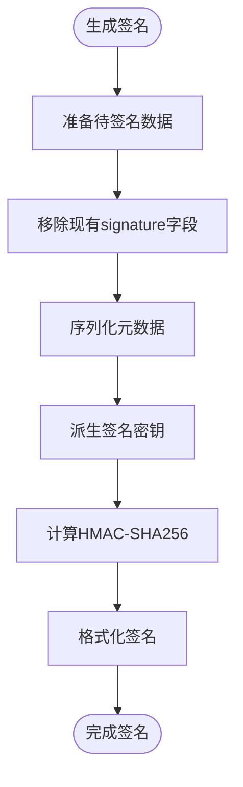

```mermaid
flowchart TD
    Start([生成签名]) --> PrepareData[准备待签名数据]
    PrepareData --> RemoveSignature[移除现有signature字段]
    RemoveSignature --> SerializeMetadata[序列化元数据]
    SerializeMetadata --> DeriveSigningKey[派生签名密钥]
    DeriveSigningKey --> ComputeHMAC[计算HMAC-SHA256]
    ComputeHMAC --> FormatSignature[格式化签名]
    FormatSignature --> End([完成签名])
```