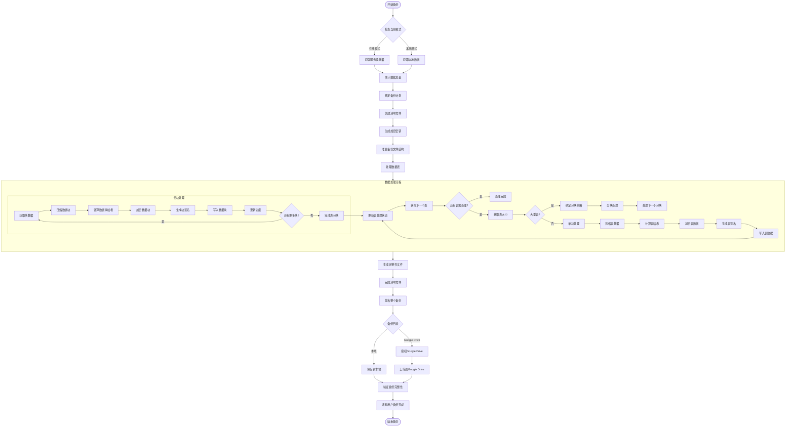

```mermaid
flowchart TD
    Start([开始备份]) --> CheckMode{检查当前模式}
    CheckMode -->|在线模式| FetchServerData[获取服务器数据]
    CheckMode -->|本地模式| FetchLocalData[获取本地数据]
    
    FetchServerData --> EstimateSize[估计数据总量]
    FetchLocalData --> EstimateSize
    
    EstimateSize --> DeterminePlan[确定备份计划]
    DeterminePlan --> CreateManifest[创建清单文件]
    CreateManifest --> GenerateKey[生成加密密钥]
    GenerateKey --> PrepareStructure[准备备份文件结构]
    
    PrepareStructure --> ProcessTables[处理数据表]
    
    subgraph DataProcessing [数据处理流程]
        A[获取下一个表] --> B{还有表需处理?}
        B -->|否| ExitProcessing[处理完成]
        B -->|是| C[获取表大小]
        
        C --> D{大型表?}
        D -->|是| E[确定分块策略]
        D -->|否| F[单块处理]
        
        E --> G[分块处理]
        G --> H[处理下一个分块]
        
        subgraph ChunkProcessing [分块处理]
            H1[获取块数据] --> H2[压缩数据块]
            H2 --> H3[计算数据块哈希]
            H3 --> H4[加密数据块]
            H4 --> H5[生成块签名]
            H5 --> H6[写入数据块]
            H6 --> H7[更新进度]
            H7 --> H8{还有更多块?}
            H8 -->|是| H1
            H8 -->|否| H9[完成表分块]
        end
        
        F --> J[压缩表数据]
        J --> K[计算表哈希]
        K --> L[加密表数据]
        L --> M[生成表签名]
        M --> N[写入表数据]
        
        H9 --> O[更新表处理状态]
        N --> O
        O --> A
    end
    
    ProcessTables --> DataProcessing
    
    DataProcessing --> GenerateIntegrity[生成完整性文件]
    GenerateIntegrity --> FinalizeManifest[完成清单文件]
    FinalizeManifest --> SignBackup[签名整个备份]
    
    SignBackup --> BackupDestination{备份目标}
    BackupDestination -->|本地| SaveLocal[保存到本地]
    BackupDestination -->|Google Drive| AuthGoogle[授权Google Drive]
    
    AuthGoogle --> UploadGoogle[上传到Google Drive]
    
    SaveLocal --> VerifyBackup[验证备份完整性]
    UploadGoogle --> VerifyBackup
    
    VerifyBackup --> NotifyUser[通知用户备份完成]
    NotifyUser --> End([结束备份])
```