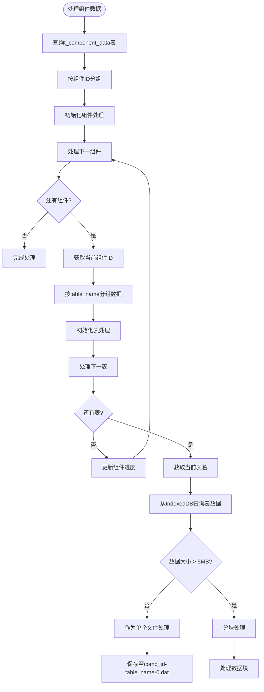

```mermaid
flowchart TD
    Start([处理组件数据]) --> QueryDB[查询t_component_data表]
    QueryDB --> GroupByComp[按组件ID分组]
    GroupByComp --> InitCompProcess[初始化组件处理]
    
    InitCompProcess --> ProcessNextComp[处理下一组件]
    ProcessNextComp --> MoreComps{还有组件?}
    MoreComps -->|否| CompleteProcess[完成处理]
    MoreComps -->|是| GetCompID[获取当前组件ID]
    
    GetCompID --> GroupByTable[按table_name分组数据]
    GroupByTable --> InitTableProcess[初始化表处理]
    
    InitTableProcess --> ProcessNextTable[处理下一表]
    ProcessNextTable --> MoreTables{还有表?}
    MoreTables -->|否| UpdateCompProgress[更新组件进度]
    MoreTables -->|是| GetTableName[获取当前表名]
    
    UpdateCompProgress --> ProcessNextComp
    
    GetTableName --> QueryTableData[从IndexedDB查询表数据]
    QueryTableData --> DataSize{数据大小 > 5MB?}
    
    DataSize -->|否| SingleFile[作为单个文件处理]
    DataSize -->|是| ChunkedProcessing[分块处理]
    
    SingleFile --> SaveCompData[保存至comp_id-table_name-0.dat]
    ChunkedProcessing --> ProcessDataChunks[处理数据块]
    
    
```