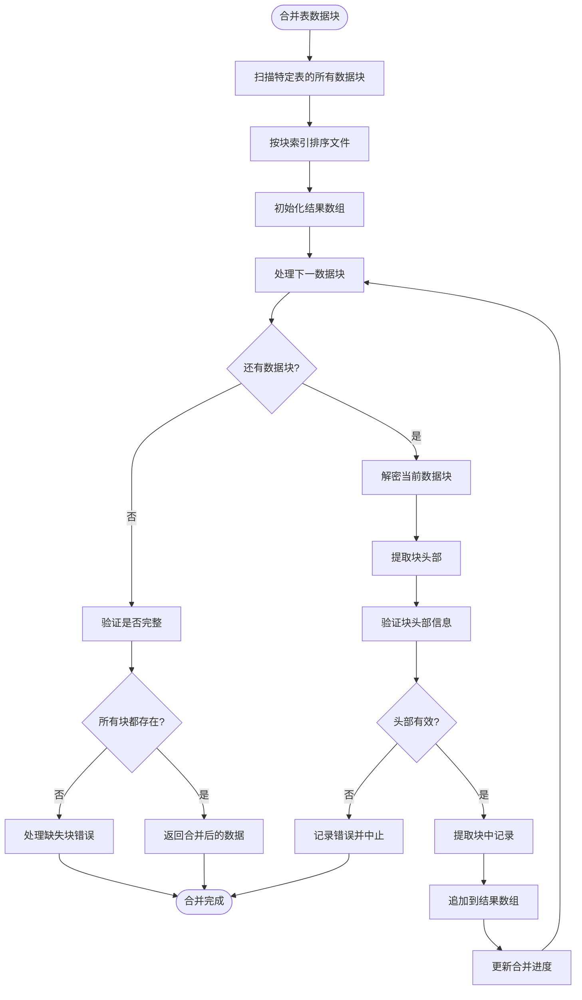

```mermaid
flowchart TD
    Start([合并表数据块]) --> ScanFiles[扫描特定表的所有数据块]
    ScanFiles --> SortByIndex[按块索引排序文件]
    SortByIndex --> InitResults[初始化结果数组]
    
    InitResults --> ProcessNextChunk[处理下一数据块]
    ProcessNextChunk --> MoreChunks{还有数据块?}
    
    MoreChunks -->|否| ValidateComplete[验证是否完整]
    MoreChunks -->|是| DecryptChunk[解密当前数据块]
    
    DecryptChunk --> ExtractHeader[提取块头部]
    ExtractHeader --> ValidateHeader[验证块头部信息]
    
    ValidateHeader --> HeaderValid{头部有效?}
    HeaderValid -->|否| HandleHeaderError[记录错误并中止]
    HeaderValid -->|是| ExtractChunkRecords[提取块中记录]
    
    ExtractChunkRecords --> AppendToResults[追加到结果数组]
    AppendToResults --> UpdateProgress[更新合并进度]
    UpdateProgress --> ProcessNextChunk
    
    ValidateComplete --> AllBlocksPresent{所有块都存在?}
    AllBlocksPresent -->|否| HandleMissingBlocks[处理缺失块错误]
    AllBlocksPresent -->|是| ReturnMergedData[返回合并后的数据]
    
    ReturnMergedData --> End([合并完成])
    HandleHeaderError --> End
    HandleMissingBlocks --> End
```