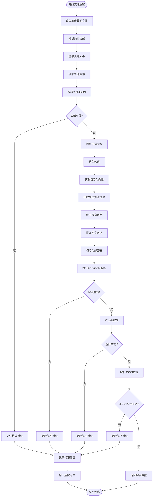

```mermaid
flowchart TD
    Start([开始文件解密]) --> ReadFile[读取加密数据文件]
    ReadFile --> ParseHeader[解析加密头部]
    
    ParseHeader --> ExtractHeaderSize[提取头部大小]
    ExtractHeaderSize --> ReadHeaderData[读取头部数据]
    ReadHeaderData --> ParseHeaderJSON[解析头部JSON]
    
    ParseHeaderJSON --> HeaderValid{头部有效?}
    HeaderValid -->|否| DecryptionError[文件格式错误]
    HeaderValid -->|是| ExtractParams[提取加密参数]
    
    ExtractParams --> GetSalt[获取盐值]
    GetSalt --> GetIV[获取初始化向量]
    GetIV --> GetAlgorithm[获取加密算法信息]
    
    GetAlgorithm --> DeriveKey[派生解密密钥]
    DeriveKey --> ExtractCiphertext[提取密文数据]
    ExtractCiphertext --> InitDecryption[初始化解密器]
    
    InitDecryption --> PerformDecryption[执行AES-GCM解密]
    PerformDecryption --> DecryptionSuccess{解密成功?}
    
    DecryptionSuccess -->|否| HandleDecryptError[处理解密错误]
    DecryptionSuccess -->|是| DecompressData[解压缩数据]
    
    DecompressData --> DecompressionSuccess{解压成功?}
    DecompressionSuccess -->|否| HandleDecompressError[处理解压错误]
    DecompressionSuccess -->|是| ParseJSON[解析JSON数据]
    
    ParseJSON --> JSONValid{JSON格式有效?}
    JSONValid -->|否| HandleParseError[处理解析错误]
    JSONValid -->|是| ReturnDecryptedData[返回解密数据]
    
    ReturnDecryptedData --> End([解密完成])
    
    DecryptionError --> LogError[记录错误信息]
    HandleDecryptError --> LogError
    HandleDecompressError --> LogError
    HandleParseError --> LogError
    
    LogError --> ThrowException[抛出解密异常]
    ThrowException --> End
```