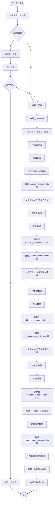

```mermaid

flowchart TD
    Start([在线模式备份]) --> CheckAuth[检查用户认证状态]
    CheckAuth --> AuthValid{认证有效?}
    
    AuthValid -->|否| RequestLogin[请求用户登录]
    AuthValid -->|是| BackupSmallTables[备份小型表]
    
    RequestLogin --> UserLogin[用户登录]
    UserLogin --> LoginSuccess{登录成功?}
    LoginSuccess -->|是| BackupSmallTables
    LoginSuccess -->|否| ShowAuthError[显示认证错误]
    
    ShowAuthError --> End([结束])
    
    BackupSmallTables --> BackupCanvas[备份t_canvas表]
    BackupCanvas --> GetCanvasFromAPI[从服务端API获取空间数据]
    GetCanvasFromAPI --> SerializeCanvas[序列化数据]
    SerializeCanvas --> EncryptCanvas[加密数据]
    EncryptCanvas --> SaveCanvasFile[保存至canvas-0.dat]
    
    SaveCanvasFile --> BackupCanvasComps[备份t_canvas_components表]
    BackupCanvasComps --> GetCanvasCompsFromAPI[从服务端API获取组件数据]
    GetCanvasCompsFromAPI --> SerializeCanvasComps[序列化数据]
    SerializeCanvasComps --> EncryptCanvasComps[加密数据]
    EncryptCanvasComps --> SaveCanvasCompsFile[保存至canvas_components-0.dat]
    
    SaveCanvasCompsFile --> BackupSidebarComps[备份t_sidebar_components表]
    BackupSidebarComps --> GetSidebarCompsFromAPI[从服务端API获取侧边栏数据]
    GetSidebarCompsFromAPI --> SerializeSidebarComps[序列化数据]
    SerializeSidebarComps --> EncryptSidebarComps[加密数据]
    EncryptSidebarComps --> SaveSidebarCompsFile[保存至sidebar_components-0.dat]
    
    SaveSidebarCompsFile --> BackupHashTables[备份t_component_table_hash表]
    BackupHashTables --> GetHashTablesFromAPI[从服务端API获取哈希表数据]
    GetHashTablesFromAPI --> SerializeHashTables[序列化数据]
    SerializeHashTables --> EncryptHashTables[加密数据]
    EncryptHashTables --> SaveHashTablesFile[保存至component_table_hash-0.dat]
    
    SaveHashTablesFile --> BackupCompData[备份t_component_data表]
    BackupCompData --> ProcessCompData[处理组件数据]
    
    ProcessCompData --> BackupInstData[备份t_component_instance_data表]
    BackupInstData --> ProcessInstData[处理组件实例数据]
    
    ProcessInstData --> CalculateIntegrity[计算文件完整性哈希]
    CalculateIntegrity --> CreateMetadataFile[创建元数据文件]
    
    CreateMetadataFile --> End

```