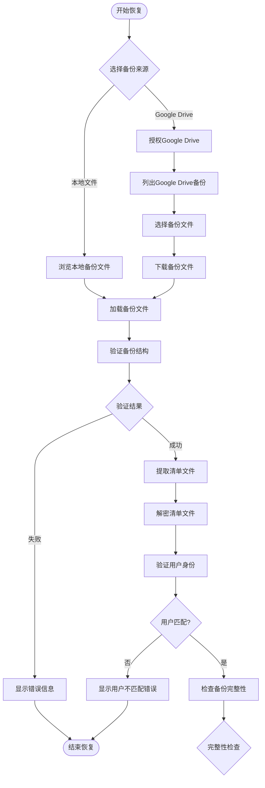

```mermaid
flowchart TD
    Start([开始恢复]) --> SelectSource{选择备份来源}
    SelectSource -->|本地文件| BrowseLocal[浏览本地备份文件]
    SelectSource -->|Google Drive| AuthGoogle[授权Google Drive]
    
    BrowseLocal --> LoadBackup[加载备份文件]
    AuthGoogle --> ListGDriveBackups[列出Google Drive备份]
    ListGDriveBackups --> SelectBackup[选择备份文件]
    SelectBackup --> DownloadBackup[下载备份文件]
    DownloadBackup --> LoadBackup
    
    LoadBackup --> ValidateStructure[验证备份结构]
    ValidateStructure --> ValidationResult{验证结果}
    
    ValidationResult -->|失败| ShowError[显示错误信息]
    ShowError --> End([结束恢复])
    
    ValidationResult -->|成功| ExtractManifest[提取清单文件]
    ExtractManifest --> DecryptManifest[解密清单文件]
    DecryptManifest --> VerifyUser[验证用户身份]
    
    VerifyUser --> UserMatch{用户匹配?}
    UserMatch -->|否| ShowUserError[显示用户不匹配错误]
    ShowUserError --> End
    
    UserMatch -->|是| CheckIntegrity[检查备份完整性]
    CheckIntegrity --> IntegrityResult{完整性检查}
    
    
```