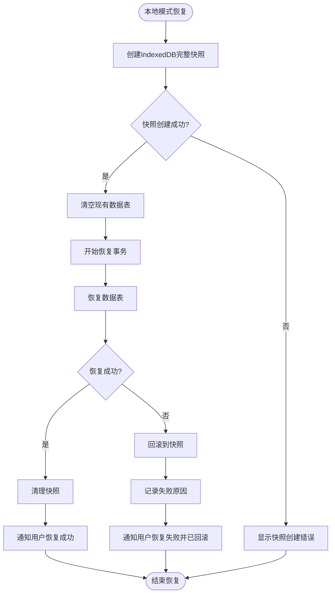

```mermaid
flowchart TD
    Start([本地模式恢复]) --> CreateSnapshot[创建IndexedDB完整快照]
    CreateSnapshot --> SnapshotCreated{快照创建成功?}
    
    SnapshotCreated -->|否| ShowSnapshotError[显示快照创建错误]
    SnapshotCreated -->|是| ClearExistingData[清空现有数据表]
    
    ClearExistingData --> BeginTransaction[开始恢复事务]
    BeginTransaction --> RestoreDataTables[恢复数据表]
    
    RestoreDataTables --> Success{恢复成功?}
    Success -->|是| CleanupSnapshot[清理快照]
    Success -->|否| RollbackChanges[回滚到快照]
    
    
    RollbackChanges --> LogFailure[记录失败原因]
    
    CleanupSnapshot --> NotifySuccess[通知用户恢复成功]
    LogFailure --> NotifyFailure[通知用户恢复失败并已回滚]
    
    NotifySuccess --> End([结束恢复])
    NotifyFailure --> End
    ShowSnapshotError --> End
```