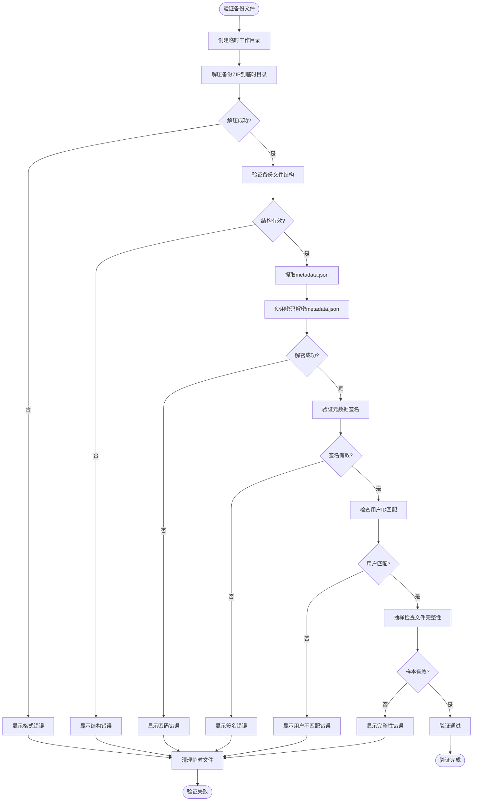

```mermaid
flowchart TD
    Start([验证备份文件]) --> CreateTempDir[创建临时工作目录]
    CreateTempDir --> ExtractZip[解压备份ZIP到临时目录]
    
    ExtractZip --> ExtractSuccess{解压成功?}
    ExtractSuccess -->|否| ShowFormatError[显示格式错误]
    ExtractSuccess -->|是| ValidateStructure[验证备份文件结构]
    
    ValidateStructure --> StructureValid{结构有效?}
    StructureValid -->|否| ShowStructureError[显示结构错误]
    StructureValid -->|是| ExtractMetadata[提取metadata.json]
    
    ExtractMetadata --> DecryptMetadata[使用密码解密metadata.json]
    DecryptMetadata --> DecryptSuccess{解密成功?}
    DecryptSuccess -->|否| ShowPasswordError[显示密码错误]
    DecryptSuccess -->|是| ValidateSignature[验证元数据签名]
    
    ValidateSignature --> SignatureValid{签名有效?}
    SignatureValid -->|否| ShowSignatureError[显示签名错误]
    SignatureValid -->|是| CheckUserMatch[检查用户ID匹配]
    
    CheckUserMatch --> UserMatch{用户匹配?}
    UserMatch -->|否| ShowUserError[显示用户不匹配错误]
    UserMatch -->|是| SampleFileCheck[抽样检查文件完整性]
    
    SampleFileCheck --> SamplesValid{样本有效?}
    SamplesValid -->|否| ShowIntegrityError[显示完整性错误]
    SamplesValid -->|是| ValidationSuccess[验证通过]
    
    ValidationSuccess --> End([验证完成])
    
    ShowFormatError --> CleanupTemp[清理临时文件]
    ShowPasswordError --> CleanupTemp
    ShowStructureError --> CleanupTemp
    ShowSignatureError --> CleanupTemp
    ShowUserError --> CleanupTemp
    ShowIntegrityError --> CleanupTemp
    
    CleanupTemp --> EndWithError([验证失败])
```