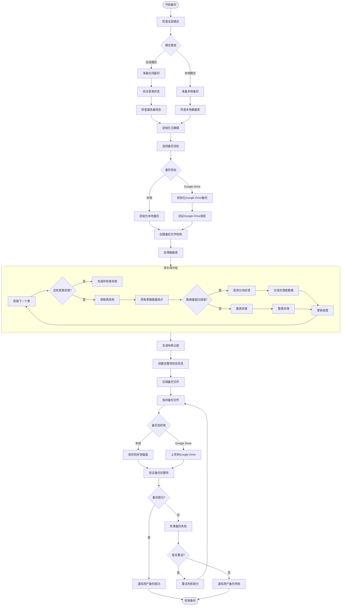

```mermaid
flowchart TD
    Start([开始备份]) --> CheckMode[检查当前模式]
    CheckMode --> ModeType{模式类型}
    
    ModeType -->|在线模式| PrepareOnlineBackup[准备在线备份]
    ModeType -->|本地模式| PrepareLocalBackup[准备本地备份]
    
    PrepareOnlineBackup --> ValidateLogin[验证登录状态]
    ValidateLogin --> CheckServer[检查服务器状态]
    CheckServer --> InitMetadata[初始化元数据]
    
    PrepareLocalBackup --> CheckLocalDB[检查本地数据库]
    CheckLocalDB --> InitMetadata
    
    InitMetadata --> SelectBackupTarget[选择备份目标]
    SelectBackupTarget --> BackupTarget{备份目标}
    
    BackupTarget -->|本地| InitLocalBackup[初始化本地备份]
    BackupTarget -->|Google Drive| InitGDriveBackup[初始化Google Drive备份]
    
    InitLocalBackup --> CreateBackupStructure[创建备份文件结构]
    InitGDriveBackup --> AuthGDrive[验证Google Drive授权]
    AuthGDrive --> CreateBackupStructure
    
    CreateBackupStructure --> ProcessTables[处理数据表]
    
    subgraph TableProcessing [表处理流程]
        A[获取下一个表] --> B{还有表需处理?}
        B -->|否| ExitTableLoop[完成所有表处理]
        B -->|是| C[获取表结构]
        
        C --> D[获取表数据量统计]
        D --> E{数据量超过阈值?}
        
        E -->|是| F[启用分块处理]
        E -->|否| G[整表处理]
        
        F --> ProcessWithChunks[分块处理表数据]
        G --> ProcessWholeTable[整表处理]
        
        ProcessWithChunks --> UpdateProgress1[更新进度]
        ProcessWholeTable --> UpdateProgress1
        
        UpdateProgress1 --> A
    end
    
    ProcessTables --> TableProcessing
    
    TableProcessing --> GenerateHashRecords[生成哈希记录]
    GenerateHashRecords --> CreateIntegrityInfo[创建完整性校验信息]
    CreateIntegrityInfo --> CompressBackup[压缩备份文件]
    
    CompressBackup --> SaveBackup[保存备份文件]
    SaveBackup --> BackupDest{备份目的地}
    
    BackupDest -->|本地| SaveToLocal[保存到本地磁盘]
    BackupDest -->|Google Drive| SaveToGDrive[上传到Google Drive]
    
    SaveToLocal --> ValidateBackup[验证备份完整性]
    SaveToGDrive --> ValidateBackup
    
    ValidateBackup --> BackupSuccess{备份成功?}
    BackupSuccess -->|是| NotifySuccess[通知用户备份成功]
    BackupSuccess -->|否| HandleFailure[处理备份失败]
    
    NotifySuccess --> End([结束备份])
    HandleFailure --> RetryOption{是否重试?}
    RetryOption -->|是| RetryFailedParts[重试失败部分]
    RetryOption -->|否| NotifyFailure[通知用户备份失败]
    
    RetryFailedParts --> SaveBackup
    NotifyFailure --> End
```