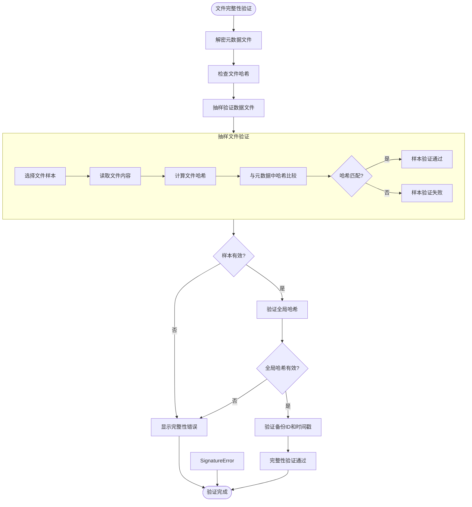

```mermaid
flowchart TD
    Start([文件完整性验证]) --> DecryptMetadata[解密元数据文件]
    DecryptMetadata --> CheckFileHashes[检查文件哈希]
    
    CheckFileHashes --> SampleDataFiles[抽样验证数据文件]
    
    subgraph SampleValidation [抽样文件验证]
        SV1[选择文件样本] --> SV2[读取文件内容]
        SV2 --> SV3[计算文件哈希]
        SV3 --> SV4[与元数据中哈希比较]
        SV4 --> SV5{哈希匹配?}
        SV5 -->|是| SV6[样本验证通过]
        SV5 -->|否| SV7[样本验证失败]
    end
    
    SampleDataFiles --> SampleValidation
    
    SampleValidation --> SamplesValid{样本有效?}
    SamplesValid -->|否| IntegrityError[显示完整性错误]
    SamplesValid -->|是| CheckGlobalHash[验证全局哈希]
    
    CheckGlobalHash --> GlobalHashValid{全局哈希有效?}
    GlobalHashValid -->|否| IntegrityError
    GlobalHashValid -->|是| ValidateBackupID[验证备份ID和时间戳]
    
    ValidateBackupID --> ValidationComplete[完整性验证通过]
    ValidationComplete --> End([验证完成])
    
    SignatureError --> End
    IntegrityError --> End
```