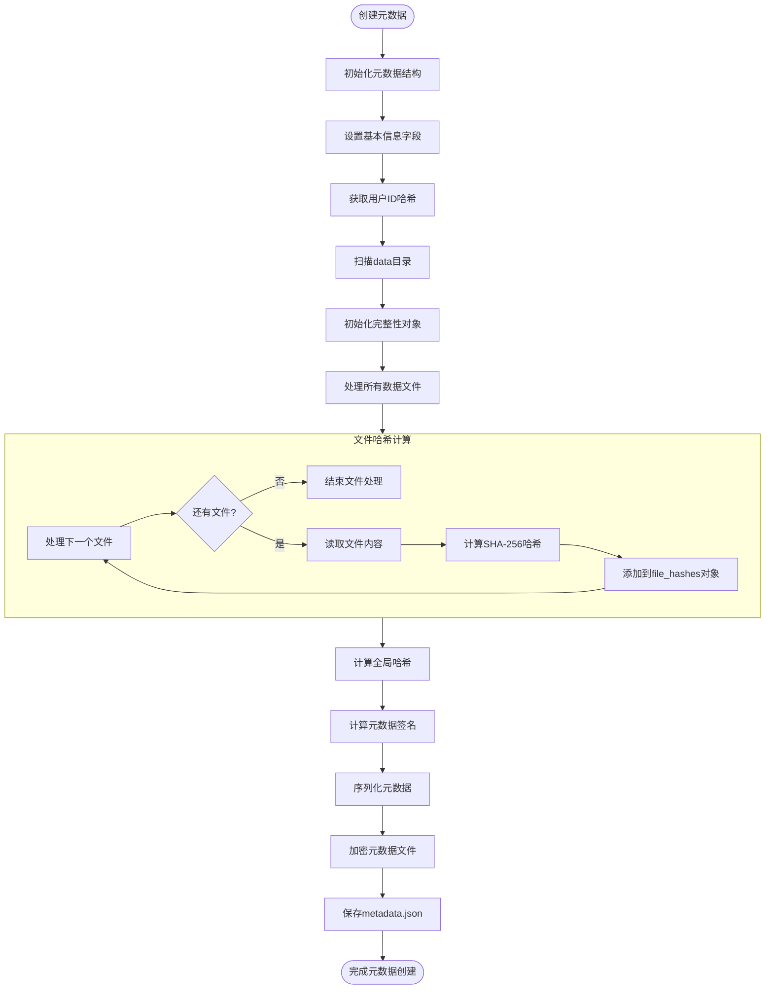

```mermaid
flowchart TD
    Start([创建元数据]) --> InitMeta[初始化元数据结构]
    InitMeta --> SetBasicInfo[设置基本信息字段]
    SetBasicInfo --> GetUserIDHash[获取用户ID哈希]
    
    GetUserIDHash --> ScanDataDir[扫描data目录]
    ScanDataDir --> InitIntegrity[初始化完整性对象]
    
    InitIntegrity --> ProcessFiles[处理所有数据文件]
    
    subgraph FileHashCalculation [文件哈希计算]
        PF1[处理下一个文件] --> PF2{还有文件?}
        PF2 -->|否| PF6[结束文件处理]
        PF2 -->|是| PF3[读取文件内容]
        PF3 --> PF4[计算SHA-256哈希]
        PF4 --> PF5[添加到file_hashes对象]
        PF5 --> PF1
    end
    
    ProcessFiles --> FileHashCalculation
    
    FileHashCalculation --> CalcGlobalHash[计算全局哈希]
    CalcGlobalHash --> SignMetadata[计算元数据签名]
    
    SignMetadata --> SerializeMetadata[序列化元数据]
    SerializeMetadata --> EncryptMetadata[加密元数据文件]
    EncryptMetadata --> SaveMetadataFile[保存metadata.json]
    
    SaveMetadataFile --> End([完成元数据创建])
```