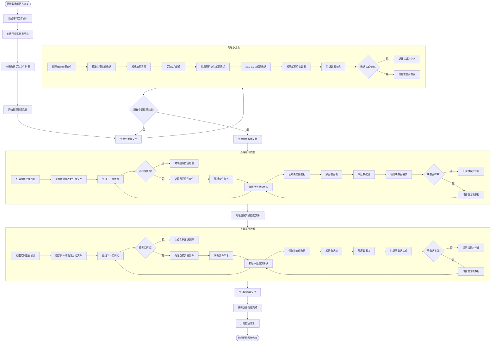

```mermaid
flowchart TD
    Start([开始数据解密与恢复]) --> CreateTempDir[创建临时工作目录]
    CreateTempDir --> CreateBackupPoint[创建目标系统备份点]
    CreateBackupPoint --> ExtractFileList[从元数据提取文件列表]
    
    ExtractFileList --> BeginProcessingFiles[开始处理数据文件]
    BeginProcessingFiles --> ProcessSmallTables[处理小型表文件]
    
    subgraph SmallTableProcessing [处理小型表]
        ST1[处理canvas表文件] --> ST2[读取加密文件数据]
        ST2 --> ST3[解析加密头部]
        ST3 --> ST4[提取IV和盐值]
        ST4 --> ST5[使用密码派生解密密钥]
        ST5 --> ST6[AES-GCM解密数据]
        ST6 --> ST7[解压解密后的数据]
        ST7 --> ST8[验证数据格式]
        ST8 --> ST9{数据格式有效?}
        ST9 -->|否| ST10[记录错误并中止]
        ST9 -->|是| ST11[准备恢复表数据]
    end
    
    ProcessSmallTables --> SmallTableProcessing
    
    SmallTableProcessing --> AllSmallTablesProcessed{所有小表处理完成?}
    AllSmallTablesProcessed -->|否| ProcessSmallTables
    AllSmallTablesProcessed -->|是| ProcessComponentData[处理组件数据文件]
    
    ProcessComponentData --> ComponentDataProcessing[处理组件数据]
    
    subgraph ComponentDataProcessing [处理组件数据]
        CD1[扫描组件数据目录] --> CD2[按组件ID和表名分组文件]
        CD2 --> CD3[处理下一组件组]
        CD3 --> CD4{还有组件组?}
        CD4 -->|否| CD15[完成组件数据处理]
        CD4 -->|是| CD5[处理当前组件文件]
        CD5 --> CD6[解析文件命名]
        CD6 --> CD7[按顺序处理文件块]
        CD7 --> CD8[读取块文件数据]
        CD8 --> CD9[解密数据块]
        CD9 --> CD10[解压数据块]
        CD10 --> CD11[验证块数据格式]
        CD11 --> CD12{块数据有效?}
        CD12 -->|否| CD13[记录错误并中止]
        CD12 -->|是| CD14[准备恢复块数据]
        CD14 --> CD7
        CD7 --> CD3
    end
    
    ComponentDataProcessing --> ProcessInstanceData[处理组件实例数据文件]
    
    ProcessInstanceData --> InstanceDataProcessing[处理实例数据]
    
    subgraph InstanceDataProcessing [处理实例数据]
        ID1[扫描实例数据目录] --> ID2[按实例ID和表名分组文件]
        ID2 --> ID3[处理下一实例组]
        ID3 --> ID4{还有实例组?}
        ID4 -->|否| ID15[完成实例数据处理]
        ID4 -->|是| ID5[处理当前实例文件]
        ID5 --> ID6[解析文件命名]
        ID6 --> ID7[按顺序处理文件块]
        ID7 --> ID8[读取块文件数据]
        ID8 --> ID9[解密数据块]
        ID9 --> ID10[解压数据块]
        ID10 --> ID11[验证块数据格式]
        ID11 --> ID12{块数据有效?}
        ID12 -->|否| ID13[记录错误并中止]
        ID12 -->|是| ID14[准备恢复块数据]
        ID14 --> ID7
        ID7 --> ID3
    end
    
    InstanceDataProcessing --> ProcessHashTables[处理哈希表文件]
    ProcessHashTables --> AllFilesProcessed[所有文件处理完成]
    
    AllFilesProcessed --> BeginDataRestore[开始数据恢复]
    BeginDataRestore --> End([继续目标系统恢复])
```