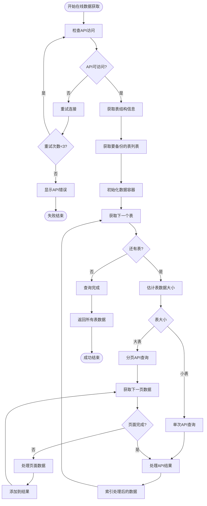

```mermaid
flowchart TD
    Start([开始在线数据获取]) --> CheckAPIAccess[检查API访问]
    CheckAPIAccess --> APIAccessible{API可访问?}
    
    APIAccessible -->|否| RetryAPIAccess[重试连接]
    RetryAPIAccess --> RetryCount{重试次数<3?}
    RetryCount -->|是| CheckAPIAccess
    RetryCount -->|否| ShowAPIError[显示API错误]
    ShowAPIError --> End([失败结束])
    
    APIAccessible -->|是| FetchTableSchema[获取表结构信息]
    FetchTableSchema --> GetTablesList[获取要备份的表列表]
    
    GetTablesList --> InitDataContainers[初始化数据容器]
    InitDataContainers --> GetNextTable[获取下一个表]
    
    GetNextTable --> HasMoreTables{还有表?}
    HasMoreTables -->|否| CompleteQuery[查询完成]
    HasMoreTables -->|是| EstimateTableSize[估计表数据大小]
    
    EstimateTableSize --> TableSize{表大小}
    
    TableSize -->|小表| SingleAPIQuery[单次API查询]
    TableSize -->|大表| PaginatedQuery[分页API查询]
    
    SingleAPIQuery --> ProcessResults[处理API结果]
    
    PaginatedQuery --> FetchNextPage[获取下一页数据]
    FetchNextPage --> PageDone{页面完成?}
    PageDone -->|否| ProcessPage[处理页面数据]
    ProcessPage --> AppendResults[添加到结果]
    AppendResults --> FetchNextPage
    
    PageDone -->|是| ProcessResults
    
    ProcessResults --> IndexData[索引处理后的数据]
    IndexData --> GetNextTable
    
    CompleteQuery --> ReturnData[返回所有表数据]
    ReturnData --> EndSuccess([成功结束])
```