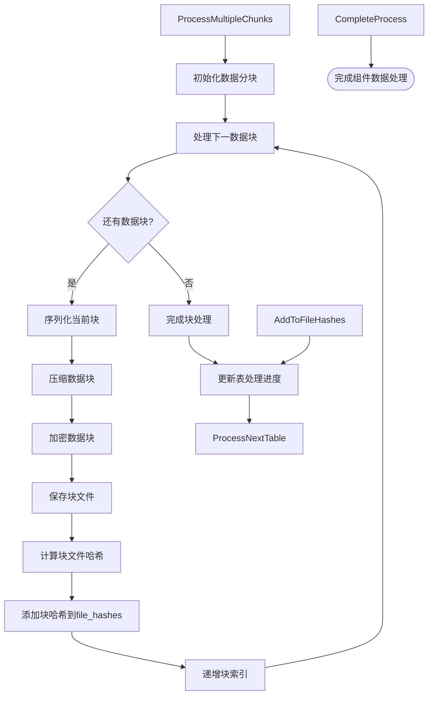

```mermaid
flowchart TD
    ProcessMultipleChunks --> InitChunks[初始化数据分块]
    InitChunks --> ProcessNextChunk[处理下一数据块]
    
    ProcessNextChunk --> MoreChunks{还有数据块?}
    MoreChunks -->|否| CompleteChunks[完成块处理]
    MoreChunks -->|是| SerializeChunk[序列化当前块]
    
    SerializeChunk --> CompressChunk[压缩数据块]
    CompressChunk --> EncryptChunk[加密数据块]
    EncryptChunk --> SaveChunkFile[保存块文件]
    SaveChunkFile --> CalcChunkHash[计算块文件哈希]
    CalcChunkHash --> AddChunkHash[添加块哈希到file_hashes]
    AddChunkHash --> IncrementChunkIndex[递增块索引]
    IncrementChunkIndex --> ProcessNextChunk
    
    CompleteChunks --> UpdateTableProgress[更新表处理进度]
    AddToFileHashes --> UpdateTableProgress
    UpdateTableProgress --> ProcessNextTable
    
    CompleteProcess --> End([完成组件数据处理])
```