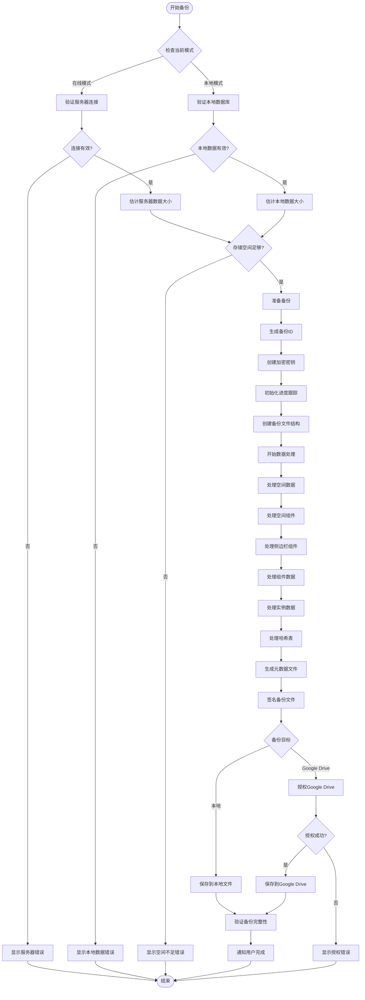

```mermaid
flowchart TD
    Start([开始备份]) --> CheckMode{检查当前模式}
    CheckMode -->|在线模式| ValidateServerConn[验证服务器连接]
    CheckMode -->|本地模式| ValidateLocalDB[验证本地数据库]
    
    ValidateServerConn --> ServerValid{连接有效?}
    ServerValid -->|否| ShowServerError[显示服务器错误]
    ServerValid -->|是| EstimateDataSize[估计服务器数据大小]
    
    ValidateLocalDB --> LocalValid{本地数据有效?}
    LocalValid -->|否| ShowLocalError[显示本地数据错误]
    LocalValid -->|是| EstimateLocalSize[估计本地数据大小]
    
    ShowServerError --> End([结束])
    ShowLocalError --> End
    
    EstimateDataSize --> EnoughSpace{存储空间足够?}
    EstimateLocalSize --> EnoughSpace
    
    EnoughSpace -->|否| ShowSpaceError[显示空间不足错误]
    EnoughSpace -->|是| PrepareBackup[准备备份]
    
    ShowSpaceError --> End
    
    PrepareBackup --> GenerateBackupID[生成备份ID]
    GenerateBackupID --> CreateEncryptionKey[创建加密密钥]
    CreateEncryptionKey --> InitProgress[初始化进度跟踪]
    
    InitProgress --> CreateBackupStructure[创建备份文件结构]
    CreateBackupStructure --> StartDataProcessing[开始数据处理]
    
    StartDataProcessing --> ProcessCanvas[处理空间数据]
    ProcessCanvas --> ProcessCanvasComp[处理空间组件]
    ProcessCanvasComp --> ProcessSidebarComp[处理侧边栏组件]
    ProcessSidebarComp --> ProcessCompData[处理组件数据]
    ProcessCompData --> ProcessInstanceData[处理实例数据]
    ProcessInstanceData --> ProcessHashTables[处理哈希表]
    
    ProcessHashTables --> GenerateMetadata[生成元数据文件]
    GenerateMetadata --> SignBackup[签名备份文件]
    
    SignBackup --> BackupDestination{备份目标}
    BackupDestination -->|本地| SaveToLocal[保存到本地文件]
    BackupDestination -->|Google Drive| AuthGDrive[授权Google Drive]
    
    AuthGDrive --> GDriveAuth{授权成功?}
    GDriveAuth -->|否| ShowAuthError[显示授权错误]
    GDriveAuth -->|是| SaveToGDrive[保存到Google Drive]
    
    SaveToLocal --> VerifyBackup[验证备份完整性]
    SaveToGDrive --> VerifyBackup
    
    VerifyBackup --> NotifyComplete[通知用户完成]
    NotifyComplete --> End
    
    ShowAuthError --> End
```