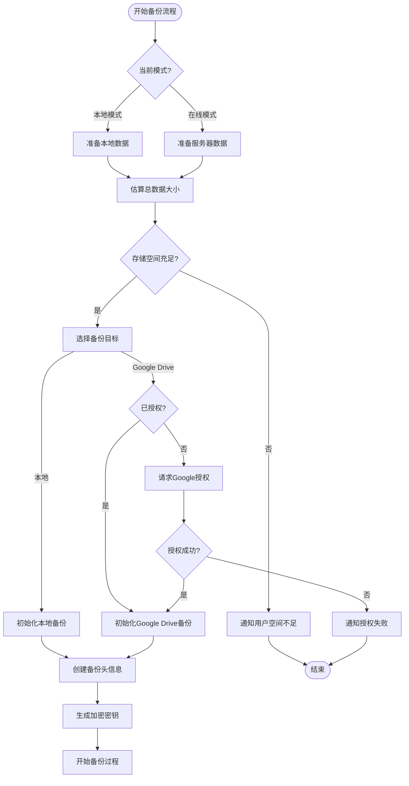

```mermaid
flowchart TD
    Start([开始备份流程]) --> CheckMode{当前模式?}
    CheckMode -->|本地模式| PrepareLocal[准备本地数据]
    CheckMode -->|在线模式| PrepareServer[准备服务器数据]
    
    PrepareLocal --> EstimateSize[估算总数据大小]
    PrepareServer --> EstimateSize
    
    EstimateSize --> CheckStorage{存储空间充足?}
    CheckStorage -->|否| NotifySpace[通知用户空间不足]
    CheckStorage -->|是| SelectDest[选择备份目标]
    
    SelectDest -->|本地| InitLocalBackup[初始化本地备份]
    SelectDest -->|Google Drive| CheckAuth{已授权?}
    
    CheckAuth -->|否| RequestAuth[请求Google授权]
    CheckAuth -->|是| InitGDriveBackup[初始化Google Drive备份]
    
    RequestAuth --> AuthSuccess{授权成功?}
    AuthSuccess -->|是| InitGDriveBackup
    AuthSuccess -->|否| NotifyAuthFail[通知授权失败]
    
    InitLocalBackup --> CreateHeader[创建备份头信息]
    InitGDriveBackup --> CreateHeader
    
    CreateHeader --> GenerateKey[生成加密密钥]
    GenerateKey --> StartBackup[开始备份过程]
    
    NotifySpace --> End([结束])
    NotifyAuthFail --> End
```