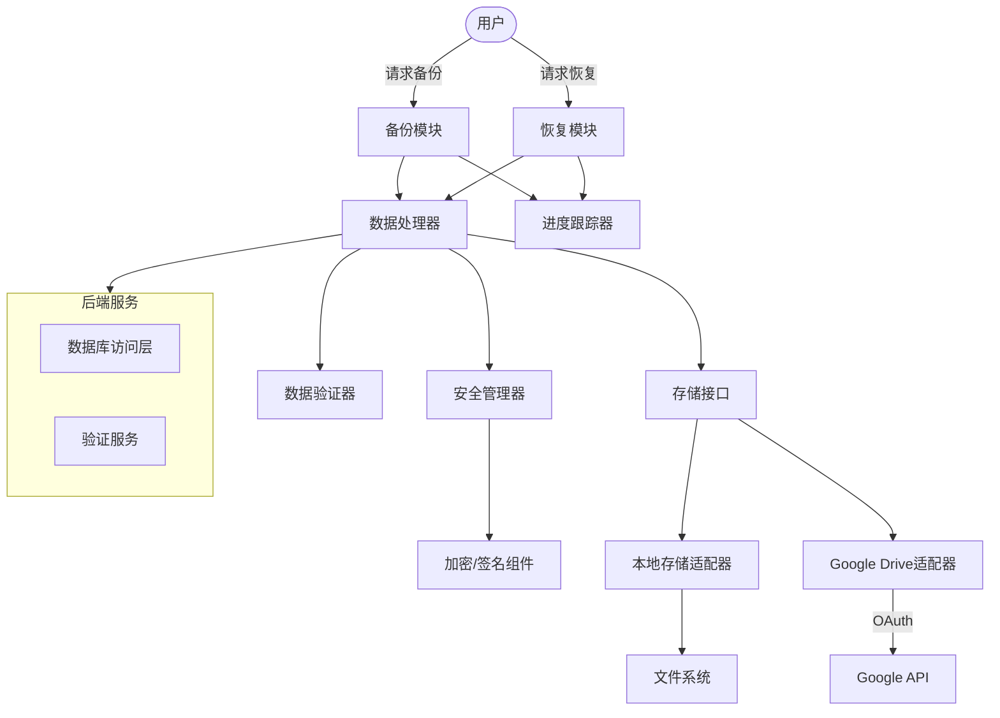

```mermaid
flowchart TD
    User([用户]) --> |请求备份| BackupModule[备份模块]
    User --> |请求恢复| RestoreModule[恢复模块]
    
    BackupModule --> DataProcessor[数据处理器]
    RestoreModule --> DataProcessor
    
    DataProcessor --> DataValidator[数据验证器]
    DataProcessor --> SecurityManager[安全管理器]
    
    SecurityManager --> Encryptor[加密/签名组件]
    
    DataProcessor --> StorageInterface[存储接口]
    
    StorageInterface --> LocalStorage[本地存储适配器]
    StorageInterface --> GoogleDriveAdapter[Google Drive适配器]
    
    LocalStorage --> FileSystem[文件系统]
    GoogleDriveAdapter --> |OAuth| GoogleAPI[Google API]
    
    BackupModule --> ProgressTracker[进度跟踪器]
    RestoreModule --> ProgressTracker
    
    subgraph Backend [后端服务]
        DBAccess[数据库访问层]
        ValidationService[验证服务]
    end
    
    DataProcessor --> Backend
```