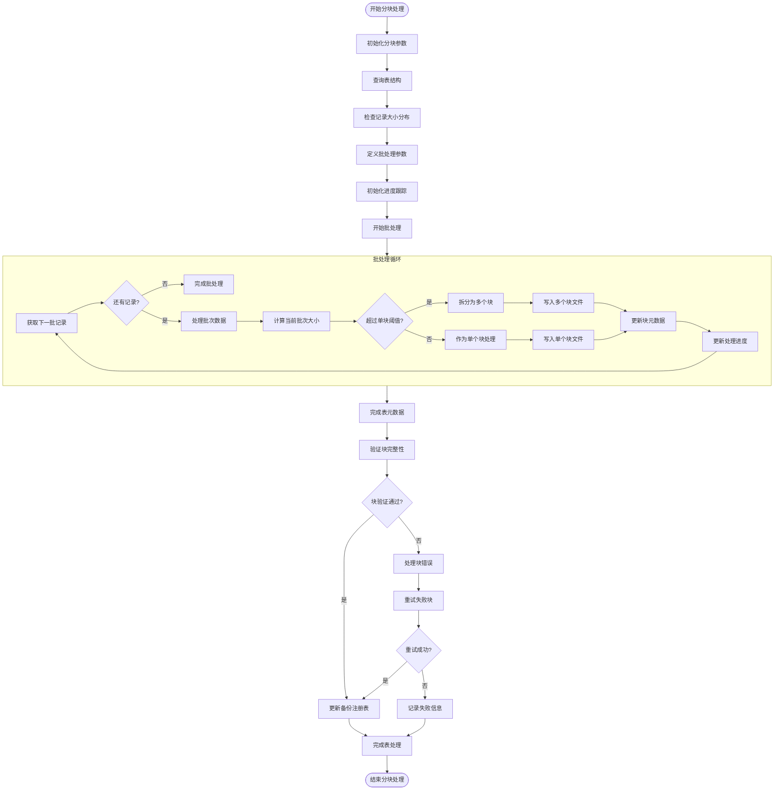

```mermaid
flowchart TD
    Start([开始分块处理]) --> InitChunking[初始化分块参数]
    InitChunking --> QueryTableStructure[查询表结构]
    QueryTableStructure --> CheckRecordSize[检查记录大小分布]
    
    CheckRecordSize --> DefineBatchParams[定义批处理参数]
    DefineBatchParams --> InitProgressTracker[初始化进度跟踪]
    
    InitProgressTracker --> StartBatchProcessing[开始批处理]
    
    subgraph BatchProcess [批处理循环]
        A[获取下一批记录] --> B{还有记录?}
        B -->|否| ExitBatch[完成批处理]
        B -->|是| C[处理批次数据]
        
        C --> D[计算当前批次大小]
        D --> E{超过单块阈值?}
        
        E -->|是| F[拆分为多个块]
        E -->|否| G[作为单个块处理]
        
        F --> WriteMultiChunks[写入多个块文件]
        G --> WriteSingleChunk[写入单个块文件]
        
        WriteMultiChunks --> UpdateChunkMetadata1[更新块元数据]
        WriteSingleChunk --> UpdateChunkMetadata1
        
        UpdateChunkMetadata1 --> H[更新处理进度]
        H --> A
    end
    
    StartBatchProcessing --> BatchProcess
    BatchProcess --> FinalizeTableMetadata[完成表元数据]
    FinalizeTableMetadata --> ValidateChunks[验证块完整性]
    
    ValidateChunks --> ChunksValid{块验证通过?}
    ChunksValid -->|是| UpdateBackupRegistry[更新备份注册表]
    ChunksValid -->|否| HandleChunkErrors[处理块错误]
    
    HandleChunkErrors --> RetryFailedChunks[重试失败块]
    RetryFailedChunks --> RetrySuccess{重试成功?}
    
    RetrySuccess -->|是| UpdateBackupRegistry
    RetrySuccess -->|否| LogFailure[记录失败信息]
    
    UpdateBackupRegistry --> CompleteTableProcessing[完成表处理]
    LogFailure --> CompleteTableProcessing
    
    CompleteTableProcessing --> End([结束分块处理])
```