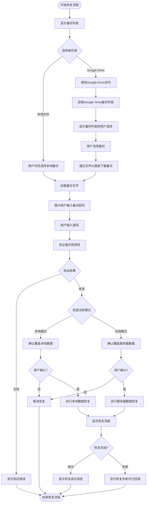

```mermaid
flowchart TD
    Start([开始恢复流程]) --> ShowRestoreDialog[显示备份列表]
    ShowRestoreDialog --> SelectSource{选择备份源}
    
    SelectSource -->|本地文件| BrowseLocalFile[用户浏览选择本地备份]
    SelectSource -->|Google Drive| AuthGDrive[授权Google Drive访问]
    
    BrowseLocalFile --> LoadBackupFile[加载备份文件]
    
    AuthGDrive --> FetchBackupList[获取Google Drive备份列表]
    FetchBackupList --> DisplayBackupsList[显示备份列表供用户选择]
    DisplayBackupsList --> UserSelectsBackup[用户选择备份]
    UserSelectsBackup --> DownloadGDriveBackup[通过文件ID直接下载备份]
    DownloadGDriveBackup --> LoadBackupFile
    
    LoadBackupFile --> PromptPassword[提示用户输入备份密码]
    PromptPassword --> UserEntersPassword[用户输入密码]
    UserEntersPassword --> ValidateBackup[验证备份有效性]
    
    ValidateBackup --> ValidationResult{验证结果}
    ValidationResult -->|无效| ShowValidationError[显示验证错误]
    ValidationResult -->|有效| CheckCurrentMode{检查当前模式}
    
    CheckCurrentMode -->|本地模式| ConfirmLocalRestore[确认覆盖本地数据]
    CheckCurrentMode -->|在线模式| ConfirmServerRestore[确认覆盖服务器数据]
    
    ConfirmLocalRestore --> UserConfirm1{用户确认?}
    UserConfirm1 -->|否| CancelRestore[取消恢复]
    UserConfirm1 -->|是| ExecuteLocalRestore[执行本地数据恢复]
    
    ConfirmServerRestore --> UserConfirm2{用户确认?}
    UserConfirm2 -->|否| CancelRestore
    UserConfirm2 -->|是| ExecuteServerRestore[执行服务器数据恢复]
    
    ExecuteLocalRestore --> ShowProgress[显示恢复进度]
    ExecuteServerRestore --> ShowProgress
    
    ShowProgress --> RestoreComplete{恢复完成?}
    RestoreComplete -->|成功| ShowSuccess[显示恢复成功消息]
    RestoreComplete -->|失败| ShowFailure[显示恢复失败并已回滚]
    
    ShowSuccess --> End([结束恢复流程])
    ShowFailure --> End
    ShowValidationError --> End
    CancelRestore --> End
```