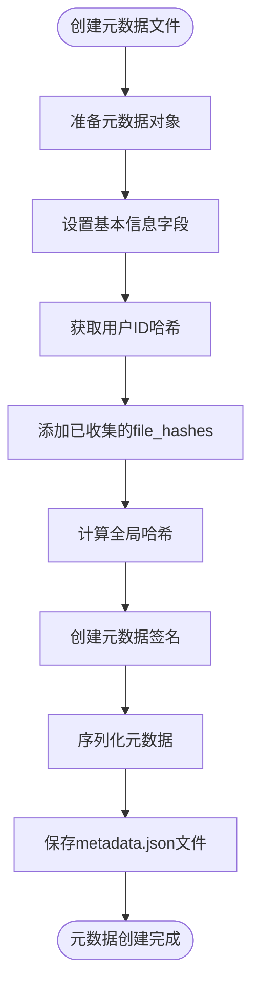

```mermaid

flowchart TD
    Start([创建元数据文件]) --> PrepareMetadataObj[准备元数据对象]
    PrepareMetadataObj --> SetBasicInfo[设置基本信息字段]
    SetBasicInfo --> GetUserIDHash[获取用户ID哈希]
    
    GetUserIDHash --> AddFileHashes[添加已收集的file_hashes]
    AddFileHashes --> CalculateGlobalHash[计算全局哈希]
    
    CalculateGlobalHash --> CreateSignature[创建元数据签名]
    CreateSignature --> SerializeMetadata[序列化元数据]
    SerializeMetadata --> SaveMetadataFile[保存metadata.json文件]
    
    SaveMetadataFile --> End([元数据创建完成])

```