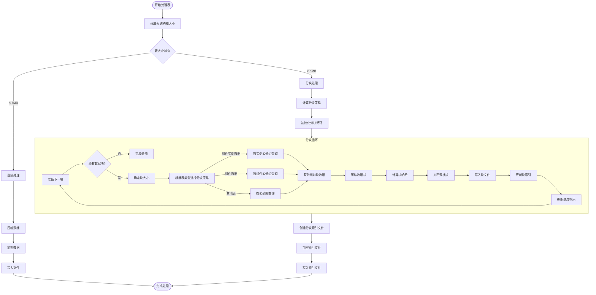

```mermaid
flowchart TD
    Start([开始处理表]) --> GetTableInfo[获取表结构和大小]
    GetTableInfo --> SizeCheck{表大小检查}
    
    SizeCheck -->|< 5MB| DirectProcess[直接处理]
    SizeCheck -->|≥ 5MB| ChunkProcess[分块处理]
    
    DirectProcess --> CompressData[压缩数据]
    CompressData --> EncryptData[加密数据]
    EncryptData --> WriteFile[写入文件]
    WriteFile --> End([完成处理])
    
    ChunkProcess --> CalculateChunks[计算分块策略]
    
    CalculateChunks --> InitChunkLoop[初始化分块循环]
    
    subgraph ChunkLoop [分块循环]
        A[准备下一块] --> B{还有数据块?}
        B -->|否| ExitLoop[完成分块]
        B -->|是| C[确定块大小]
        
        C --> D[根据表类型选择分块策略]
        
        D -->|组件实例数据| E1[按实例ID分组查询]
        D -->|组件数据| E2[按组件ID分组查询]
        D -->|其他表| E3[按ID范围查询]
        
        E1 --> F[获取当前块数据]
        E2 --> F
        E3 --> F
        
        F --> G[压缩数据块]
        G --> H[计算块哈希]
        H --> I[加密数据块]
        I --> J[写入块文件]
        
        J --> K[更新块索引]
        K --> L[更新进度指示]
        
        L --> A
    end
    
    InitChunkLoop --> ChunkLoop
    
    ChunkLoop --> CreateChunkIndex[创建分块索引文件]
    CreateChunkIndex --> EncryptIndex[加密索引文件]
    EncryptIndex --> WriteIndexFile[写入索引文件]
    
    WriteIndexFile --> End
```