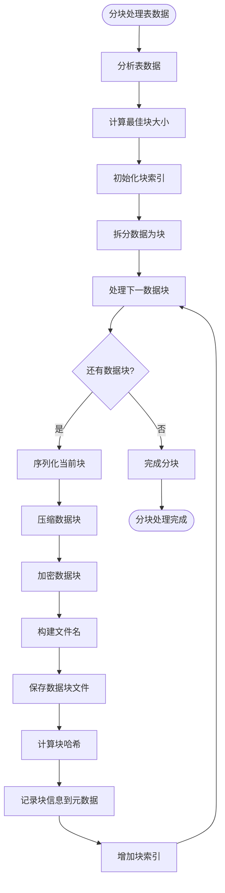

```mermaid
flowchart TD
    Start([分块处理表数据]) --> AnalyzeData[分析表数据]
    AnalyzeData --> CalcChunkSize[计算最佳块大小]
    CalcChunkSize --> InitChunkIndex[初始化块索引]
    
    InitChunkIndex --> SplitData[拆分数据为块]
    SplitData --> ProcessNextChunk[处理下一数据块]
    
    ProcessNextChunk --> MoreChunks{还有数据块?}
    MoreChunks -->|否| FinalizeChunks[完成分块]
    MoreChunks -->|是| SerializeChunk[序列化当前块]
    
    SerializeChunk --> CompressChunk[压缩数据块]
    CompressChunk --> EncryptChunk[加密数据块]
    
    EncryptChunk --> ConstructFileName[构建文件名]
    ConstructFileName --> SaveChunkFile[保存数据块文件]
    
    SaveChunkFile --> CalculateHash[计算块哈希]
    CalculateHash --> RecordChunkInfo[记录块信息到元数据]
    
    RecordChunkInfo --> IncrementIndex[增加块索引]
    IncrementIndex --> ProcessNextChunk
    
    FinalizeChunks --> End([分块处理完成])
```