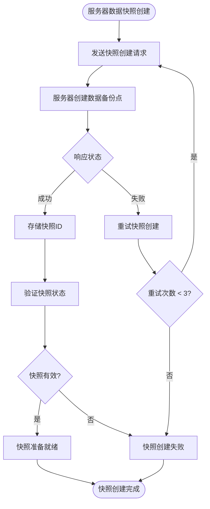

```mermaid
flowchart TD
    Start([服务器数据快照创建]) --> APIRequest[发送快照创建请求]
    APIRequest --> ServerResponse[服务器创建数据备份点]
    
    ServerResponse --> Response{响应状态}
    Response -->|成功| StoreSnapshotID[存储快照ID]
    Response -->|失败| RetrySnapshot[重试快照创建]
    
    RetrySnapshot --> RetryCount{重试次数 < 3?}
    RetryCount -->|是| APIRequest
    RetryCount -->|否| FailSnapshot[快照创建失败]
    
    StoreSnapshotID --> VerifySnapshot[验证快照状态]
    VerifySnapshot --> SnapshotValid{快照有效?}
    SnapshotValid -->|是| SnapshotReady[快照准备就绪]
    SnapshotValid -->|否| FailSnapshot
    
    SnapshotReady --> End([快照创建完成])
    FailSnapshot --> End
```