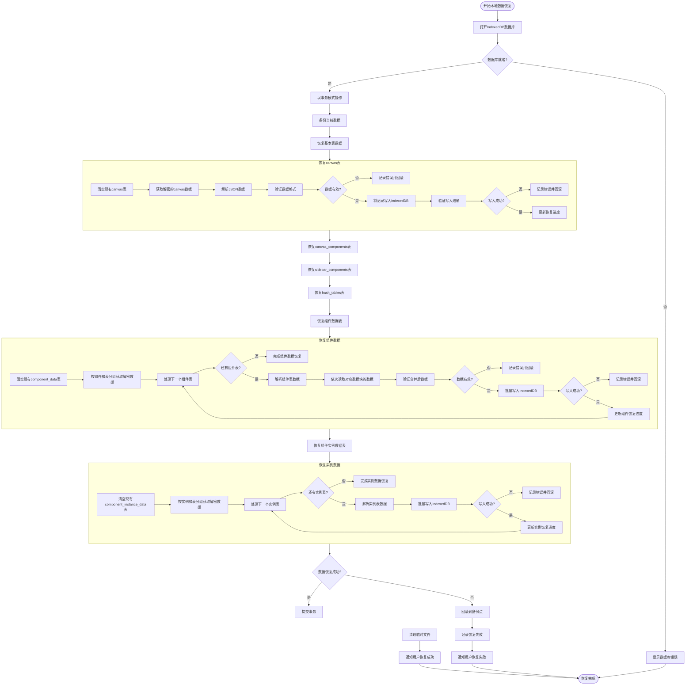

```mermaid
flowchart TD
    Start([开始本地数据恢复]) --> OpenIndexedDB[打开IndexedDB数据库]
    OpenIndexedDB --> DBReady{数据库就绪?}
    
    DBReady -->|否| ShowDBError[显示数据库错误]
    DBReady -->|是| WithTransaction[以事务模式操作]
    
    WithTransaction --> BackupCurrentData[备份当前数据]
    BackupCurrentData --> RestoreBasicTables[恢复基本表数据]
    
    subgraph RestoreCanvasTable [恢复canvas表]
        RC1[清空现有canvas表] --> RC2[获取解密的canvas数据]
        RC2 --> RC3[解析JSON数据]
        RC3 --> RC4[验证数据格式]
        RC4 --> RC5{数据有效?}
        RC5 -->|否| RC6[记录错误并回滚]
        RC5 -->|是| RC7[将记录写入IndexedDB]
        RC7 --> RC8[验证写入结果]
        RC8 --> RC9{写入成功?}
        RC9 -->|否| RC10[记录错误并回滚]
        RC9 -->|是| RC11[更新恢复进度]
    end
    
    RestoreBasicTables --> RestoreCanvasTable
    
    RestoreCanvasTable --> RestoreCanvasCompTable[恢复canvas_components表]
    RestoreCanvasCompTable --> RestoreSidebarCompTable[恢复sidebar_components表]
    RestoreSidebarCompTable --> RestoreHashTable[恢复hash_tables表]
    
    RestoreHashTable --> RestoreComponentData[恢复组件数据表]
    
    subgraph RestoreCompData [恢复组件数据]
        RCD1[清空现有component_data表] --> RCD2[按组件和表分组获取解密数据]
        RCD2 --> RCD3[处理下一个组件表]
        RCD3 --> RCD4{还有组件表?}
        RCD4 -->|否| RCD14[完成组件数据恢复]
        RCD4 -->|是| RCD5[解析组件表数据]
        RCD5 --> RCD6[依次读取对应数据块的数据]
        RCD6 --> RCD7[验证合并后数据]
        RCD7 --> RCD8{数据有效?}
        RCD8 -->|否| RCD9[记录错误并回滚]
        RCD8 -->|是| RCD10[批量写入IndexedDB]
        RCD10 --> RCD11{写入成功?}
        RCD11 -->|否| RCD12[记录错误并回滚]
        RCD11 -->|是| RCD13[更新组件恢复进度]
        RCD13 --> RCD3
    end
    
    RestoreComponentData --> RestoreCompData
    
    RestoreCompData --> RestoreInstanceData[恢复组件实例数据表]
    
    subgraph RestoreInstData [恢复实例数据]
        RID1[清空现有component_instance_data表] --> RID2[按实例和表分组获取解密数据]
        RID2 --> RID3[处理下一个实例表]
        RID3 --> RID4{还有实例表?}
        RID4 -->|否| RID14[完成实例数据恢复]
        RID4 -->|是| RID5[解析实例表数据]
        RID5 --> RID10[批量写入IndexedDB]
        RID10 --> RID11{写入成功?}
        RID11 -->|否| RID12[记录错误并回滚]
        RID11 -->|是| RID13[更新实例恢复进度]
        RID13 --> RID3
    end
    
    RestoreInstanceData --> RestoreInstData
    
    RestoreInstData --> AllDataValid{数据恢复成功?}
    
    AllDataValid -->|是| CommitTransaction[提交事务]
    AllDataValid -->|否| RollbackToBackup[回滚到备份点]
    
     CleanupTemp[清理临时文件]
    RollbackToBackup --> LogRestoreFailure[记录恢复失败]
    
    CleanupTemp --> NotifySuccess[通知用户恢复成功]
    LogRestoreFailure --> NotifyFailure[通知用户恢复失败]
    
    NotifySuccess --> End([恢复完成])
    NotifyFailure --> End
    ShowDBError --> End
```