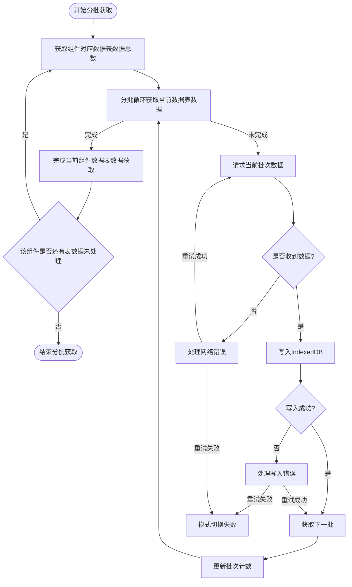

```mermaid

flowchart TD
    StartBatch([开始分批获取]) --> InitializeBatch[获取组件对应数据表数据总数]
    InitializeBatch --> CheckBatchSize[分批循环获取当前数据表数据]
    
    CheckBatchSize -->|完成| BatchComplete[完成当前组件数据表数据获取]

    BatchComplete --> HasNext{该组件是否还有表数据未处理}

    HasNext --> |是| InitializeBatch
    HasNext --> |否| EndBatch([结束分批获取])

    
    CheckBatchSize -->|未完成| RequestBatch[请求当前批次数据]
    RequestBatch --> ReceiveBatch{是否收到数据?}
    
    ReceiveBatch -->|是| WriteToDB[写入IndexedDB]
    
    WriteToDB --> BatchSuccess{写入成功?}
    BatchSuccess -->|是| NextBatch[获取下一批]
    BatchSuccess -->|否| HandleError[处理写入错误]
    HandleError -->|重试成功| NextBatch
    HandleError -->|重试失败| ModeFailed[模式切换失败]
    
    ReceiveBatch -->|否| HandleNetworkError[处理网络错误]
    HandleNetworkError -->|重试成功| RequestBatch
    HandleNetworkError -->|重试失败| ModeFailed
    
    NextBatch --> IncrementBatch[更新批次计数]
    IncrementBatch --> CheckBatchSize
    

```