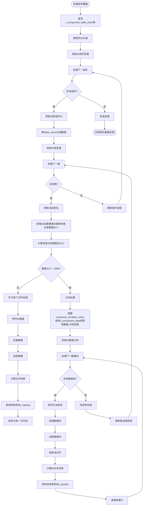

```mermaid

flowchart TD
    Start([处理组件数据]) --> QueryDB[查询t_component_table_hash表]
    QueryDB --> GroupByComp[按组件ID分组]
    GroupByComp --> InitCompProcess[初始化组件处理]
    
    InitCompProcess --> ProcessNextComp[处理下一组件]
    ProcessNextComp --> MoreComps{还有组件?}
    MoreComps -->|否| CompleteProcess[完成处理]
    MoreComps -->|是| GetCompID[获取当前组件ID]
    
    GetCompID --> GroupByTable[按table_name分组数据]
    GroupByTable --> InitTableProcess[初始化表处理]
    
    InitTableProcess --> ProcessNextTable[处理下一表]
    ProcessNextTable --> MoreTables{还有表?}

    MoreTables -->|是| GetTableName[获取当前表名]
    MoreTables -->|否| UpdateCompProgress[更新组件进度]
    
    UpdateCompProgress --> ProcessNextComp
    
    GetTableName --> CheckDataSize[获取对应数据表总数和单条记录数据大小]
    CheckDataSize --> TotalSize[计算该表对应数据总大小]

    TotalSize --> DataSize{数据大小 > 5MB?}
   
    DataSize -->|否| ProcessSingleFile[作为单个文件处理]
    DataSize -->|是| ProcessMultipleChunks[分块处理]

    ProcessMultipleChunks --> QueryTableData[根据componet_id+table_name查询t_component_data表获取数据,分批获取]
    
    ProcessSingleFile --> SerializeData[序列化数据]
    SerializeData --> CompressData[压缩数据]
    CompressData --> EncryptData[加密数据]
    EncryptData --> CalcFileHash[计算文件哈希]
    CalcFileHash --> AddToFileHashes[添加哈希到file_hashes]
    AddToFileHashes --> SaveSingleFile[保存为单一文件块]

    QueryTableData --> InitChunks[初始化数据分块]
    InitChunks --> ProcessNextChunk[处理下一数据块]
    
    ProcessNextChunk --> MoreChunks{还有数据块?}
    MoreChunks -->|否| CompleteChunks[完成块处理]
    MoreChunks -->|是| SerializeChunk[序列化当前块]
    
    SerializeChunk --> CompressChunk[压缩数据块]
    CompressChunk --> EncryptChunk[加密数据块]
    EncryptChunk --> SaveChunkFile[保存块文件]
    SaveChunkFile --> CalcChunkHash[计算块文件哈希]
    CalcChunkHash --> AddChunkHash[添加块哈希到file_hashes]
    AddChunkHash --> IncrementChunkIndex[递增块索引]
    IncrementChunkIndex --> ProcessNextChunk
    
    CompleteChunks --> UpdateTableProgress[更新表处理进度]
    UpdateTableProgress --> ProcessNextTable
    
    CompleteProcess --> End([完成组件数据处理])

```