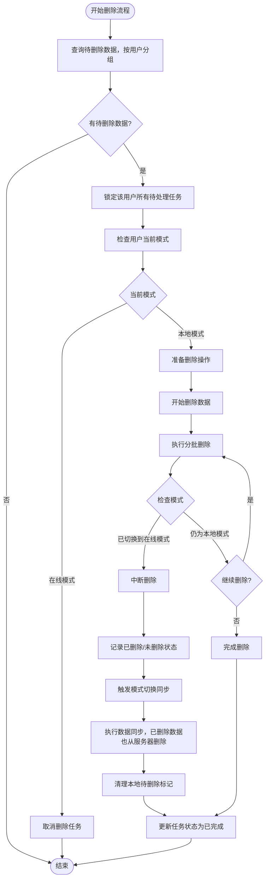

```mermaid
flowchart TD
    Start([开始删除流程]) --> FetchTasks[查询待删除数据，按用户分组]
    FetchTasks --> HasTasks{有待删除数据?}
    
    HasTasks -->|否| End([结束])
    HasTasks -->|是| LockTasks[锁定该用户所有待处理任务]
    
    LockTasks --> CheckUserMode[检查用户当前模式]
    CheckUserMode --> CurrentMode{当前模式}
    
    CurrentMode -->|在线模式| CancelTasks[取消删除任务]
    CurrentMode -->|本地模式| PrepareDelete[准备删除操作]
    
    PrepareDelete --> StartDelete[开始删除数据]
    
    StartDelete --> DeleteProcess[执行分批删除]
    DeleteProcess --> CheckModeDuring{检查模式}
    
    CheckModeDuring -->|仍为本地模式| ContinueDelete{继续删除?}
    ContinueDelete -->|是| DeleteProcess
    ContinueDelete -->|否| CompleteDelete[完成删除]
    
    CheckModeDuring -->|已切换到在线模式| InterruptDelete[中断删除]
    InterruptDelete --> RecordState[记录已删除/未删除状态]
    RecordState --> TriggerSync[触发模式切换同步]
    
    TriggerSync --> SyncProcess[执行数据同步，已删除数据也从服务器删除]
    SyncProcess --> CleanupMarkers[清理本地待删除标记]
    
    CleanupMarkers --> UpdateStatus[更新任务状态为已完成]
    CompleteDelete --> UpdateStatus
    
    CancelTasks --> End
    UpdateStatus --> End
```