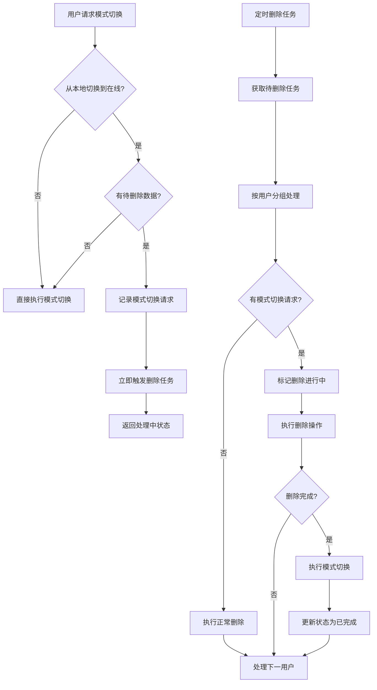

```mermaid
flowchart TD
    API[用户请求模式切换] --> CheckMode{从本地切换到在线?}
    CheckMode -->|否| DirectSwitch[直接执行模式切换]
    CheckMode -->|是| CheckDeletion{有待删除数据?}
    
    CheckDeletion -->|否| DirectSwitch
    CheckDeletion -->|是| RecordRequest[记录模式切换请求]
    RecordRequest --> TriggerDeletion[立即触发删除任务]
    TriggerDeletion --> ReturnProcessing[返回处理中状态]
    
    ScheduledTask[定时删除任务] --> FetchTasks[获取待删除任务]
    FetchTasks --> ProcessByUser[按用户分组处理]
    ProcessByUser --> CheckSwitch{有模式切换请求?}
    
    CheckSwitch -->|是| MarkProcessing[标记删除进行中]
    CheckSwitch -->|否| RegularDelete[执行正常删除]
    MarkProcessing --> ExecuteDelete[执行删除操作]
    RegularDelete --> NextUser[处理下一用户]
    
    ExecuteDelete --> CheckComplete{删除完成?}
    CheckComplete -->|否| NextUser
    CheckComplete -->|是| PerformSwitch[执行模式切换]
    PerformSwitch --> UpdateStatus[更新状态为已完成]
    UpdateStatus --> NextUser
```