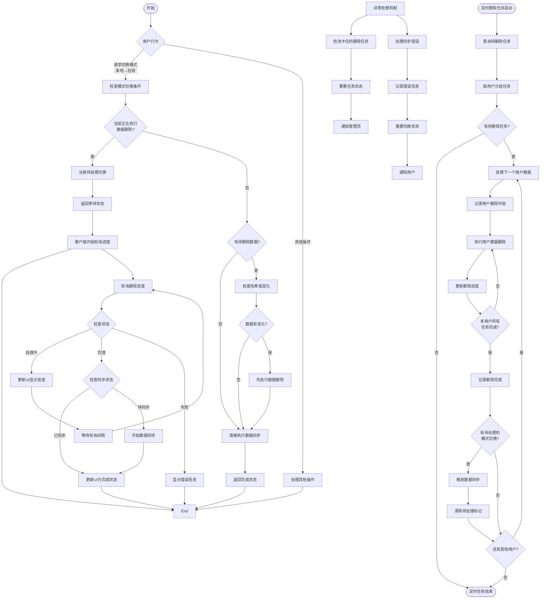

```mermaid
flowchart TD
    %% 主流程分支
    Start([开始]) --> UserAction{用户行为}
    UserAction -->|请求切换模式\n本地→在线| ModeSwitchCheck[检查模式切换条件]
    UserAction -->|其他操作| OtherOperations[处理其他操作]
    OtherOperations --> End
    
    %% 定时任务分支
    ScheduledTask([定时删除任务启动]) --> QueryDeletions[查询待删除任务]
    QueryDeletions --> GroupByUser[按用户分组任务]
    GroupByUser --> HasTasks{有待删除任务?}
    HasTasks -->|否| TaskEnd([定时任务结束])
    HasTasks -->|是| ProcessNextUser[处理下一个用户数据]
    
    %% 处理每个用户的删除任务
    ProcessNextUser --> RecordStart[记录用户删除开始]
    RecordStart --> DeleteUserData[执行用户数据删除]
    DeleteUserData --> UpdateProgress[更新删除进度]
    
    UpdateProgress --> AllCompleted{本用户所有\n任务完成?}
    AllCompleted -->|否| DeleteUserData
    
    AllCompleted -->|是| RecordCompletion[记录删除完成]
    RecordCompletion --> CheckPendingSwitch{有待处理的\n模式切换?}
    
    CheckPendingSwitch -->|是| TriggerSync[触发数据同步]
    CheckPendingSwitch -->|否| NextUserCheck{还有其他用户?}
    
    TriggerSync --> ClearPending[清除待处理标记]
    ClearPending --> NextUserCheck
    
    NextUserCheck -->|是| ProcessNextUser
    NextUserCheck -->|否| TaskEnd
    
    %% 模式切换检查流程
    ModeSwitchCheck --> CheckDeletionInProgress{当前正在执行\n数据删除?}
    
    CheckDeletionInProgress -->|是| RegisterPending[注册待处理切换]
    RegisterPending --> ReturnWaiting[返回等待状态]
    ReturnWaiting --> ClientPolling[客户端开始轮询进度]
    ClientPolling --> End
    
    CheckDeletionInProgress -->|否| CheckPendingDeletion{有待删除数据?}
    
    CheckPendingDeletion -->|否| ExecuteDataSync[直接执行数据同步]
    ExecuteDataSync --> ReturnComplete[返回完成状态]
    ReturnComplete --> End
    
    CheckPendingDeletion -->|是| CheckHashValues[检查哈希值变化]
    
    CheckHashValues --> DataChanged{数据有变化?}
    
    DataChanged -->|否| ExecuteDataSync
    
    DataChanged -->|是| DeleteBeforeSync[先执行数据删除]
    DeleteBeforeSync --> ExecuteDataSync
    
    %% 客户端轮询流程
    ClientPolling --> PollProgress[轮询删除进度]
    PollProgress --> CheckStatus{检查状态}
    
    CheckStatus -->|处理中| UpdateUI[更新UI显示进度]
    UpdateUI --> WaitInterval[等待轮询间隔]
    WaitInterval --> PollProgress
    
    CheckStatus -->|完成| CheckSyncState{检查同步状态}
    
    CheckSyncState -->|已同步| CompleteUI[更新UI为完成状态]
    CompleteUI --> End
    
    CheckSyncState -->|待同步| StartSync[开始数据同步]
    StartSync --> CompleteUI
    
    CheckStatus -->|失败| ShowError[显示错误信息]
    ShowError --> End
    
    %% 异常处理流程
    SubGraph1[异常处理机制] --> DetectStalled[检测卡住的删除任务]
    DetectStalled --> ResetTask[重置任务状态]
    ResetTask --> NotifyAdmin[通知管理员]
    
    SubGraph1 --> HandleSyncError[处理同步错误]
    HandleSyncError --> LogError[记录错误信息]
    LogError --> ResetSwitch[重置切换状态]
    ResetSwitch --> NotifyUser[通知用户]
```