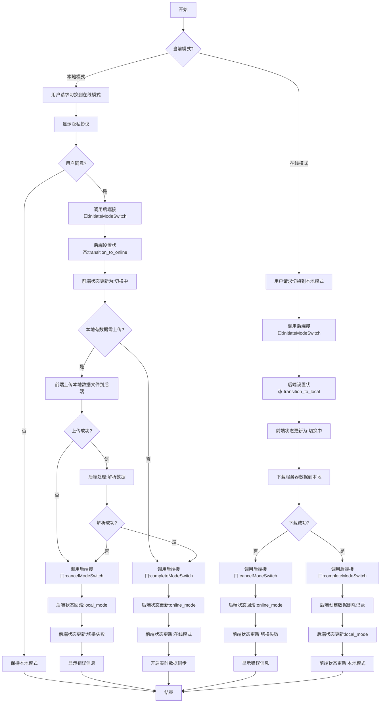

```mermaid
flowchart TD
    A[开始] --> B{当前模式?}
    
    %% 本地模式转在线模式
    B -->|本地模式| C[用户请求切换到在线模式]
    C --> D[显示隐私协议]
    D --> E{用户同意?}
    E -->|否| F[保持本地模式]
    F --> Z[结束]
    
    E -->|是| G[调用后端接口:initiateModeSwitch]
    G --> H[后端设置状态:transition_to_online]
    H --> I[前端状态更新为:切换中]
    
    I --> J{本地有数据需上传?}
    J -->|否| K[调用后端接口:completeModeSwitch]
    
    J -->|是| L[前端上传本地数据文件到后端]
    L --> M{上传成功?}
    M -->|否| N[调用后端接口:cancelModeSwitch]
    N --> O[后端状态回滚:local_mode]
    O --> P[前端状态更新:切换失败]
    P --> Q[显示错误信息]
    Q --> Z
    
    M -->|是| R[后端处理:解析数据]
    R --> S{解析成功?}
    S -->|否| N
    
    S -->|是| K[调用后端接口:completeModeSwitch]
    K --> T[后端状态更新:online_mode]
    T --> U[前端状态更新:在线模式]
    U --> V[开启实时数据同步]
    V --> Z
    
    %% 在线模式转本地模式
    B -->|在线模式| W[用户请求切换到本地模式]
    W --> X[调用后端接口:initiateModeSwitch]
    X --> Y[后端设置状态:transition_to_local]
    Y --> AA[前端状态更新为:切换中]
    
    AA --> AB[下载服务器数据到本地]
    AB --> AC{下载成功?}
    AC -->|否| AD[调用后端接口:cancelModeSwitch]
    AD --> AE[后端状态回滚:online_mode]
    AE --> AF[前端状态更新:切换失败]
    AF --> AG[显示错误信息]
    AG --> Z
    
    AC -->|是| AH[调用后端接口:completeModeSwitch]
    AH --> AI[后端创建数据删除记录]
    AI --> AJ[后端状态更新:local_mode]
    AJ --> AK[前端状态更新:本地模式]
    AK --> Z
```