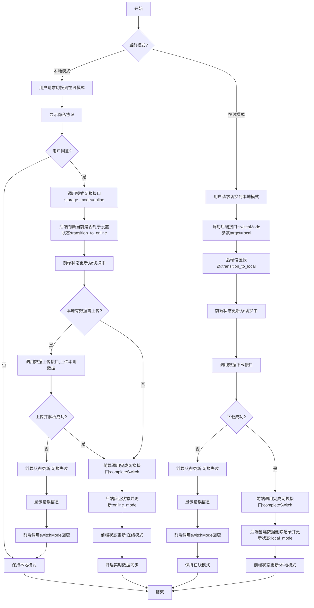

```mermaid
flowchart TD
    A[开始] --> B{当前模式?}
    
    %% 本地模式转在线模式
    B -->|本地模式| C[用户请求切换到在线模式]
    C --> D[显示隐私协议]
    D --> E{用户同意?}
    E -->|否| F[保持本地模式]
    F --> Z[结束]
    
    E -->|是| G[调用模式切换接口storage_mode=online]
    G --> H[后端判断当前是否处于设置状态:transition_to_online]
    H --> I[前端状态更新为:切换中]
    
    I --> J{本地有数据需上传?}
    
    J -->|是| L[调用数据上传接口,上传本地数据]
    L --> M{上传并解析成功?}
    M -->|否| O[前端状态更新:切换失败]
    O --> P[显示错误信息]
    P --> Q[前端调用switchMode回滚]
    Q --> F
    
    J -->|否| R[前端调用完成切换接口:completeSwitch]
    M -->|是| R
    
    R --> S[后端验证状态并更新:online_mode]
    S --> T[前端状态更新:在线模式]
    T --> U[开启实时数据同步]
    U --> Z
    
    %% 在线模式转本地模式
    B -->|在线模式| V[用户请求切换到本地模式]
    V --> W[调用后端接口:switchMode参数target=local]
    W --> X[后端设置状态:transition_to_local]
    X --> Y[前端状态更新为:切换中]
    
    Y --> Z1[调用数据下载接口]
    Z1 --> AA{下载成功?}
    AA -->|否| AB[前端状态更新:切换失败]
    AB --> AC[显示错误信息]
    AC --> AD[前端调用switchMode回滚]
    AD --> AE[保持在线模式]
    AE --> Z
    
    AA -->|是| AF[前端调用完成切换接口:completeSwitch]
    AF --> AG[后端创建数据删除记录并更新状态:local_mode]
    AG --> AH[前端状态更新:本地模式]
    AH --> Z
```