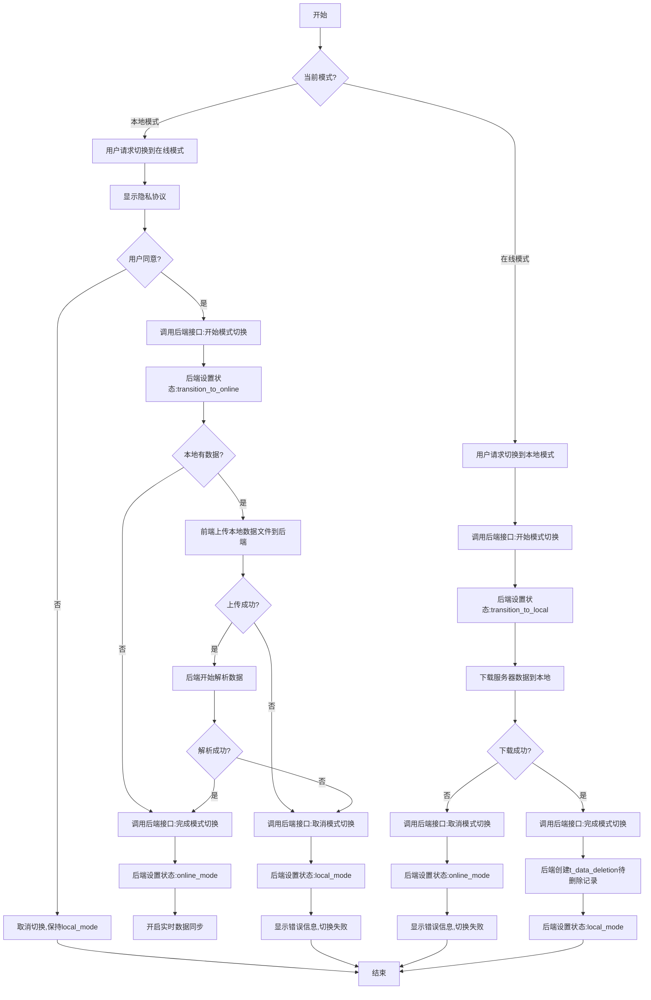

```mermaid
flowchart TD
    A[开始] --> B{当前模式?}
    
    B -->|本地模式| C[用户请求切换到在线模式]
    C --> F[显示隐私协议]
    F --> G{用户同意?}
    G -->|否| H[取消切换,保持local_mode]
    H --> Z[结束]
    
    G -->|是| I[调用后端接口:开始模式切换]
    I --> J[后端设置状态:transition_to_online]
    J --> K{本地有数据?}
    
    K -->|否| L[调用后端接口:完成模式切换]
    L --> M[后端设置状态:online_mode]
    M --> S[开启实时数据同步]
    
    K -->|是| O[前端上传本地数据文件到后端]
    O --> P{上传成功?}
    
    P -->|否| Q[调用后端接口:取消模式切换]
    Q --> R[后端设置状态:local_mode]
    R --> U[显示错误信息,切换失败]
    U --> Z
    
    P -->|是| V[后端开始解析数据]
    V --> W{解析成功?}
    
    W -->|否| Q
    W -->|是| L
    
    B -->|在线模式| T1[用户请求切换到本地模式]
    T1 --> U1[调用后端接口:开始模式切换]
    U1 --> V1[后端设置状态:transition_to_local]
    
    V1 --> X1[下载服务器数据到本地]
    X1 --> Y1{下载成功?}
    
    Y1 -->|否| Z1[调用后端接口:取消模式切换]
    Z1 --> A2[后端设置状态:online_mode]
    A2 --> B2[显示错误信息,切换失败]
    B2 --> Z
    
    Y1 -->|是| C2[调用后端接口:完成模式切换]
    C2 --> D2[后端创建t_data_deletion待删除记录]
    D2 --> E2[后端设置状态:local_mode]
    E2 --> Z
```