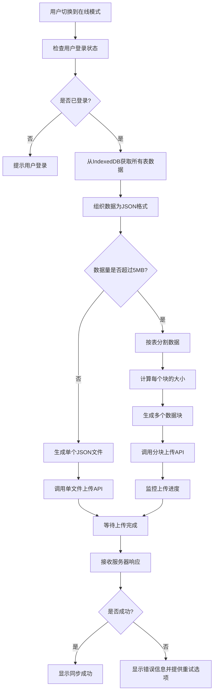

```mermaid
flowchart TD
    A[用户切换到在线模式] --> B[检查用户登录状态]
    B --> C{是否已登录?}
    C -->|否| D[提示用户登录]
    C -->|是| E[从IndexedDB获取所有表数据]
    E --> F[组织数据为JSON格式]
    F --> G{数据量是否超过5MB?}
    G -->|否| H[生成单个JSON文件]
    G -->|是| I[按表分割数据]
    I --> J[计算每个块的大小]
    J --> K[生成多个数据块]
    H --> L[调用单文件上传API]
    K --> M[调用分块上传API]
    M --> N[监控上传进度]
    L --> O[等待上传完成]
    N --> O
    O --> P[接收服务器响应]
    P --> Q{是否成功?}
    Q -->|是| R[显示同步成功]
    Q -->|否| S[显示错误信息并提供重试选项]
```