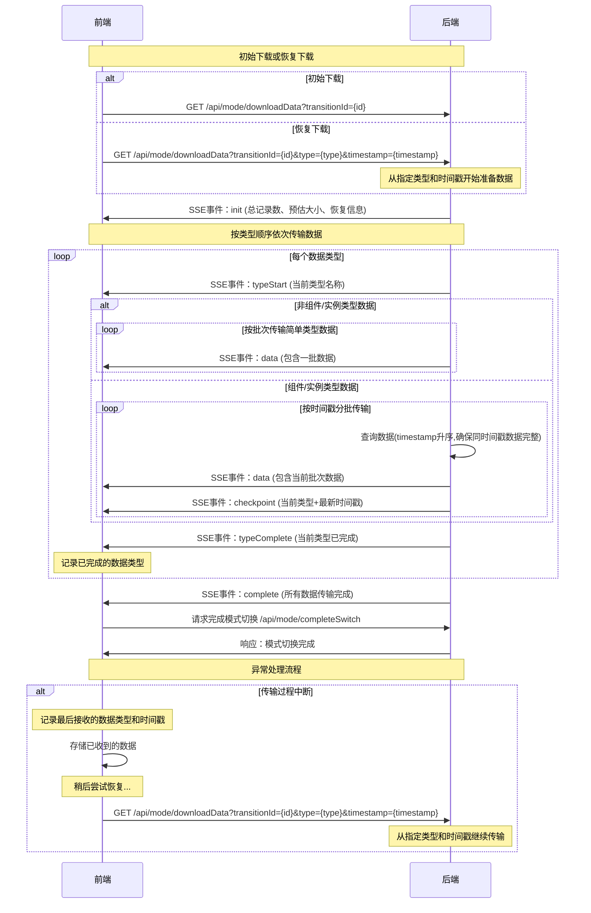

```mermaid
sequenceDiagram
    participant Client as 前端
    participant Server as 后端
    
    Note over Client,Server: 初始下载或恢复下载
    
    alt 初始下载
        Client->>Server: GET /api/mode/downloadData?transitionId={id}
    else 恢复下载
        Client->>Server: GET /api/mode/downloadData?transitionId={id}&type={type}&timestamp={timestamp}
        Note over Server: 从指定类型和时间戳开始准备数据
    end
    
    Server->>Client: SSE事件：init (总记录数、预估大小、恢复信息)
    
    Note over Client,Server: 按类型顺序依次传输数据
    
    loop 每个数据类型
        Server->>Client: SSE事件：typeStart (当前类型名称)
        
        alt 非组件/实例类型数据
            loop 按批次传输简单类型数据
                Server->>Client: SSE事件：data (包含一批数据)
            end
        else 组件/实例类型数据
            loop 按时间戳分批传输
                Server->>Server: 查询数据(timestamp升序,确保同时间戳数据完整)
                Server->>Client: SSE事件：data (包含当前批次数据)
                Server->>Client: SSE事件：checkpoint (当前类型+最新时间戳)
            end
        end
        
        Server->>Client: SSE事件：typeComplete (当前类型已完成)
        
        Note over Client: 记录已完成的数据类型
    end
    
    Server->>Client: SSE事件：complete (所有数据传输完成)
    
    Client->>Server: 请求完成模式切换 /api/mode/completeSwitch
    Server->>Client: 响应：模式切换完成
    
    Note over Client,Server: 异常处理流程
    
    alt 传输过程中断
        Note over Client: 记录最后接收的数据类型和时间戳
        Client->>Client: 存储已收到的数据
        
        Note over Client: 稍后尝试恢复...
        Client->>Server: GET /api/mode/downloadData?transitionId={id}&type={type}&timestamp={timestamp}
        Note over Server: 从指定类型和时间戳继续传输
    end
```