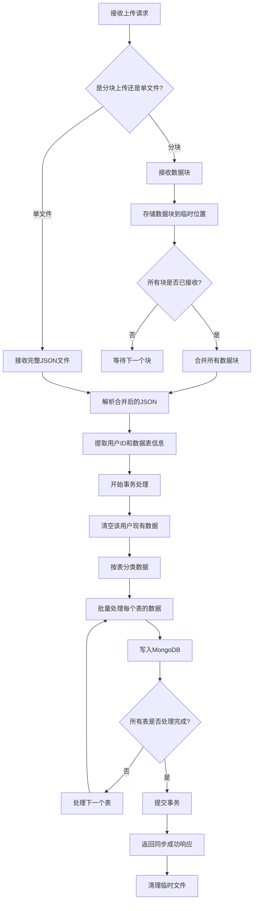

```mermaid
flowchart TD
    A[接收上传请求] --> B{是分块上传还是单文件?}
    B -->|单文件| C[接收完整JSON文件]
    B -->|分块| D[接收数据块]
    D --> E[存储数据块到临时位置]
    E --> F{所有块是否已接收?}
    F -->|否| G[等待下一个块]
    F -->|是| H[合并所有数据块]
    H --> I[解析合并后的JSON]
    C --> I
    I --> J[提取用户ID和数据表信息]
    J --> K[开始事务处理]
    K --> L[清空该用户现有数据]
    L --> M[按表分类数据]
    M --> N[批量处理每个表的数据]
    N --> O[写入MongoDB]
    O --> P{所有表是否处理完成?}
    P -->|否| Q[处理下一个表]
    Q --> N
    P -->|是| R[提交事务]
    R --> S[返回同步成功响应]
    S --> T[清理临时文件]
```