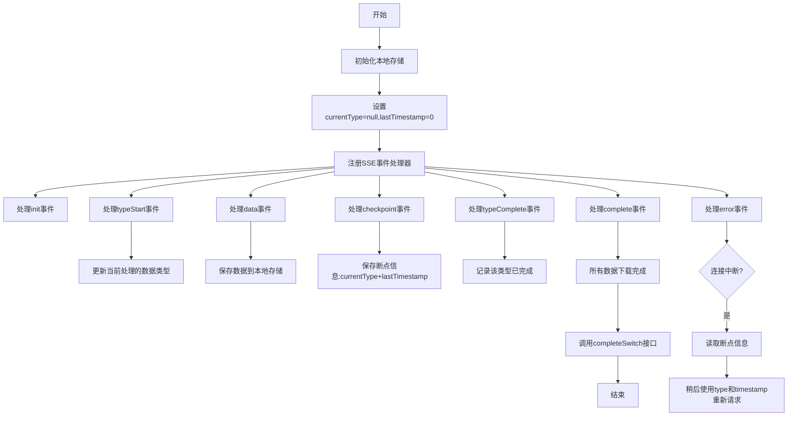

```mermaid
flowchart TD
    A[开始] --> B[初始化本地存储]
    B --> C[设置currentType=null,lastTimestamp=0]
    
    C --> D[注册SSE事件处理器]
    
    D --> E[处理init事件]
    D --> F[处理typeStart事件]
    D --> G[处理data事件]
    D --> H[处理checkpoint事件]
    D --> I[处理typeComplete事件]
    D --> J[处理complete事件]
    D --> K[处理error事件]
    
    F --> L[更新当前处理的数据类型]
    G --> M[保存数据到本地存储]
    
    H --> N[保存断点信息:currentType+lastTimestamp]
    I --> O[记录该类型已完成]
    
    K --> P{连接中断?}
    P -->|是| Q[读取断点信息]
    Q --> R[稍后使用type和timestamp重新请求]
    
    J --> S[所有数据下载完成]
    S --> T[调用completeSwitch接口]
    T --> U[结束]
```