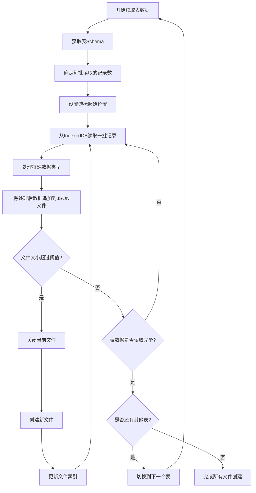

```mermaid
flowchart TD
    A[开始读取表数据] --> B[获取表Schema]
    B --> C[确定每批读取的记录数]
    C --> D[设置游标起始位置]
    
    D --> E[从IndexedDB读取一批记录]
    E --> F[处理特殊数据类型]
    F --> G[将处理后数据追加到JSON文件]
    
    G --> H{文件大小超过阈值?}
    H -->|是| I[关闭当前文件]
    I --> J[创建新文件]
    J --> K[更新文件索引]
    K --> E
    
    H -->|否| L{表数据是否读取完毕?}
    L -->|否| E
    L -->|是| M{是否还有其他表?}
    
    M -->|是| N[切换到下一个表]
    N --> A
    
    M -->|否| O[完成所有文件创建]
```