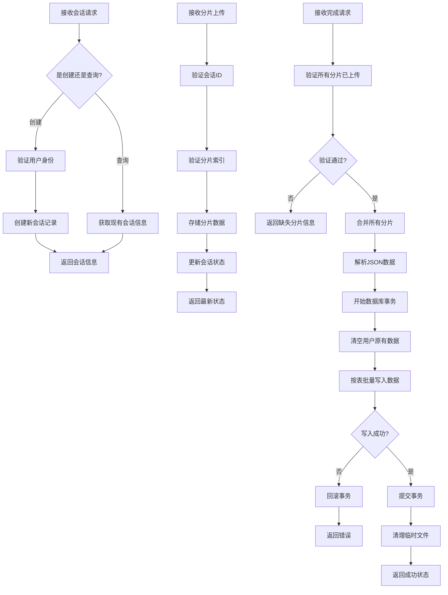

```mermaid
flowchart TD
    A[接收会话请求] --> B{是创建还是查询?}
    B -->|创建| C[验证用户身份]
    B -->|查询| D[获取现有会话信息]
    C --> E[创建新会话记录]
    E --> F[返回会话信息]
    D --> F
    
    G[接收分片上传] --> H[验证会话ID]
    H --> I[验证分片索引]
    I --> J[存储分片数据]
    J --> K[更新会话状态]
    K --> L[返回最新状态]
    
    M[接收完成请求] --> N[验证所有分片已上传]
    N --> O{验证通过?}
    O -->|否| P[返回缺失分片信息]
    O -->|是| Q[合并所有分片]
    Q --> R[解析JSON数据]
    R --> S[开始数据库事务]
    S --> T[清空用户原有数据]
    T --> U[按表批量写入数据]
    U --> V{写入成功?}
    V -->|否| W[回滚事务]
    W --> X[返回错误]
    V -->|是| Y[提交事务]
    Y --> Z[清理临时文件]
    Z --> AA[返回成功状态]
```