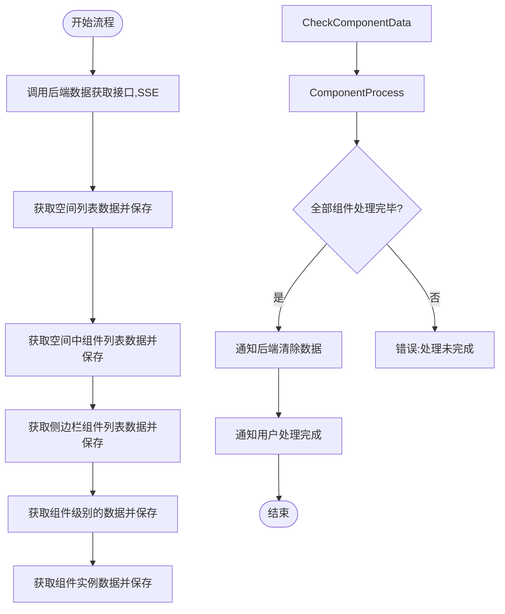

```mermaid

flowchart TD
    Start([开始流程]) --> FetchData[调用后端数据获取接口,SSE]
    FetchData --> FetchSpaceData[获取空间列表数据并保存]
   
    FetchSpaceData --> FetchSpaceComponent[获取空间中组件列表数据并保存]

    FetchSpaceComponent --> FetchSiderComponent[获取侧边栏组件列表数据并保存]

    FetchSiderComponent --> FetchComponent[获取组件级别的数据并保存]

    FetchComponent --> FetchInstance[获取组件实例数据并保存]
    
  
    
   
    
    CheckComponentData --> ComponentProcess
    ComponentProcess --> AllComponentsProcessed{全部组件处理完毕?}
    
    AllComponentsProcessed -->|是| ClearServerData[通知后端清除数据]
    AllComponentsProcessed -->|否| Error3[错误:处理未完成]
    
    ClearServerData --> CompletionNotification[通知用户处理完成]
    CompletionNotification --> End([结束])

```