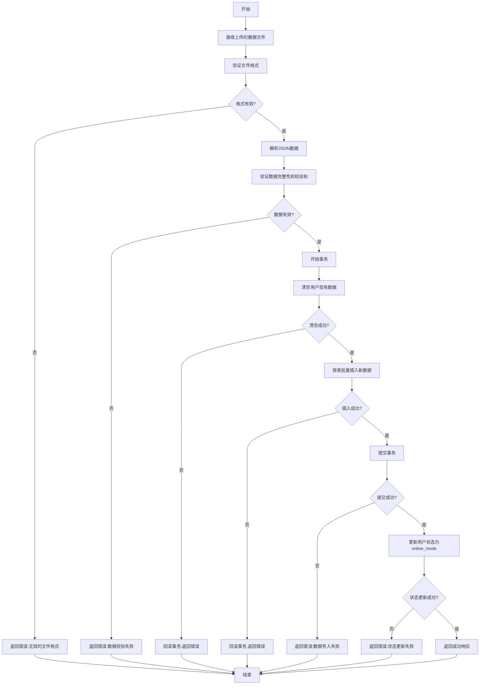

```mermaid
flowchart TD
    A[开始] --> B[接收上传的数据文件]
    B --> C[验证文件格式]
    C --> D{格式有效?}
    D -->|否| E[返回错误:无效的文件格式]
    D -->|是| F[解析JSON数据]
    
    F --> G[验证数据完整性和校验和]
    G --> H{数据有效?}
    H -->|否| I[返回错误:数据校验失败]
    H -->|是| J[开始事务]
    
    J --> K[清空用户现有数据]
    K --> L{清空成功?}
    L -->|否| M[回滚事务,返回错误]
    L -->|是| N[按表批量插入新数据]
    
    N --> O{插入成功?}
    O -->|否| P[回滚事务,返回错误]
    O -->|是| Q[提交事务]
    
    Q --> R{提交成功?}
    R -->|否| S[返回错误:数据导入失败]
    R -->|是| T[更新用户状态为online_mode]
    
    T --> U{状态更新成功?}
    U -->|否| V[返回错误:状态更新失败]
    U -->|是| W[返回成功响应]
    
    E --> X[结束]
    I --> X
    M --> X
    P --> X
    S --> X
    V --> X
    W --> X
```