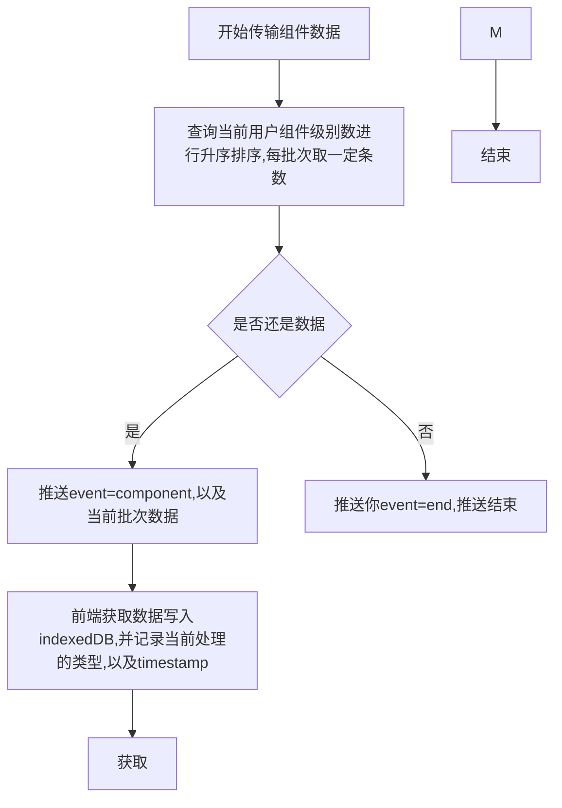

```mermaid
flowchart TD
    A[开始传输组件数据] --> B[查询当前用户组件级别数进行升序排序,每批次取一定条数]
    B --> C{是否还是数据}
    C --> |是| D[推送event=component,以及当前批次数据]
    C --> |否| E[推送你event=end,推送结束]

    D --> F[前端获取数据写入indexedDB,并记录当前处理的类型,以及timestamp]
    
    F --> G[获取]
   
    M --> N[结束]
```